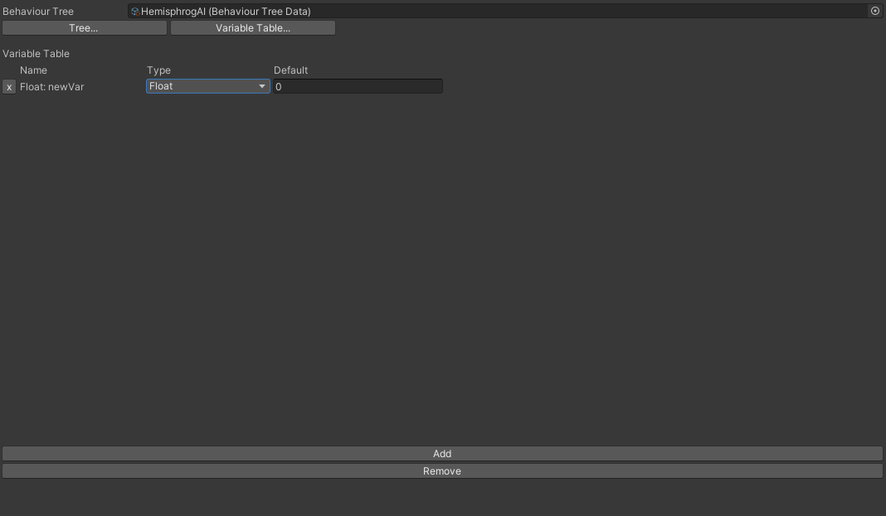

# Aethiumian AI

the documentation of the AI used by the project Library of Meialia (LOM)

([ZH](./DOC_ZH.md)|EN)

This AI system uses the structure of [Behaviour Tree](https://en.wikipedia.org/wiki/Behavior_tree_%28artificial_intelligence,_robotics_and_control%29) (behavior tree)

# Important concept

## AI (MonoBehaviour)

[Code](AI.cs) `<br>`
AI Component is a script that runs AI, adds an AI to a `gameObject`and assigns a `BehaviourTreeData` to the AI to run the specified behavior tree

## BehaviourTreeData (ScriptableObject)

[Code](BehaviourTreeData.cs) `<br>`
Behaviour Tree Data stores the data required for an AI to run, created through the directory `Create/Aethiumian AI/Behaviour Tree`
edit AI via `AI Editor`

> You can open a Behaviour Tree Data directly in Unity Inspector, but you can only see each node after being serialized, it is not recommended to edit the serialized data directly.
>
> If you open the Behaviour Tree Data in the Inspector, the top of the Inspector will warn you not to edit the content of the Asset directly, and there will be a Button to open the AI Editor directly

## AIEditor (Editor Window)

[Code](Editor/AIEditor.cs) `<br>`
AI Editor is an AI editing window, consisting of a node editor and a variable table

## BehaviourTree (Class)

[Code](BehaviourTree.cs) `<br>`
`class BehaviourTree` is the core part of AI and is responsible for the process control of the entire AI

When the behavior tree is never executed (the game starts) or the execution ends, the AI Component will start a new round of execution of the behavior tree before the next update

## TreeNode (Class)

[Code](TreeNode.cs)
`</br>`
The base type of the node, each node tells the AI what to do at this node
<\br>
The way a node is executed is controlled by the return value of its child nodes, each node of the behavior tree will give its parent a `bool` return value after execution :

- `true` when node execution ends result is true
- `false` when node execution ends result is false

If the node has no return value, Behaviour Tree will wait for the node to provide a return value

### head (root node)

The root node is the entry of the entire behavior book. Every time the behavior tree is executed, it will start from this node.

## Variable

Currently six different variables are supported

|          Type          | [VariableType](Variable/Variable.cs) |       Action       |
| :--------------------: | :-------------------------------: | :-----------------: |
|       `String`       |        VariableType.String        |          -          |
|        `Bool`        |         VariableType.Bool         |    record state    |
|       `Float`       |        VariableType.Float        |   record decimals   |
|        `Int`        |         VariableType.Int         |   record integer   |
|      `Vector2`      |       VariableType.Vector2       |          -          |
|      `Vector3`      |       VariableType.Vector3       |          -          |
| `UnityEngine.Object` |     VariableType.UnityObject     | record unity object |
|       `object`       |       VariableType.Generic       |  record any object  |

Variables with the same name are not allowed in the same AI, even if they are of different types.

Some variable type within the AI allow direct conversion:

| Target Type\Source Type | VariableType.String |          VariableType.Bool          |     VariableType.Float     |     VariableType.Int     |     VariableType.Vector2     |     VariableType.Vector3     |
| :---------------------: | :-----------------: | :----------------------------------: | :-------------------------: | :-----------------------: | :---------------------------: | :---------------------------: |
|   VariableType.String   |          -          | Convert to `true`/`false` string | Convert to `float` string | Convert to `int` string | Convert to `Vector2` string | Convert to `Vector3` string |
|    VariableType.Bool    |          x          |                  -                  |         float != 0         |         int != 0         |       vector2 != (0,0)       |      vector3 != (0,0,0)      |
|   VariableType.Float   |          x          |             bool ? 1 : 0             |              -              |        (float)int        |               x               |               x               |
|    VariableType.Int    |          x          |             bool ? 1 : 0             |         (int)float         |             -             |               x               |               x               |
|  VariableType.Vector2  |          x          |         bool ? (1,1) : (0,0)         |              x              |             x             |               -               |       (Vector2)vector3       |
|  VariableType.Vector3  |          x          |       bool ? (1,1,1) : (0,0,0)       |              x              |             x             |       (Vector3)vector2       |               -               |

> Note:
>
> `VariableType.UnityObject` and `VariableType.Generic` cannot do implicit casting unless type is specified
>
> The types and initial values of all variables are generated before the instance of the behavior tree is generated, and the types of variables cannot be changed at runtime.

Variable types in a Node :

|            |             `VariableReference`             |                          ` VariableField`                          |             - (no type) |
| :---------: | :--------------------------------------------: | :------------------------------------------------------------------: | ----------------------: |
|   `<T>`   | The location can be a variable of type <`T`> | The location can be a variable of type <`T`> or **constant** |                       - |
| Non-Generic |  The location can be a variable of any type *  |  The location can be a variable of any type* or a**constant**  | a constant of that type |

|         Declaration         |            Explanation            |
| :--------------------------: | :--------------------------------: |
|          `float`          |           float constant           |
|   `VariableField<float>`   |     float variable or constant     |
| `VariableReference<float>` |           float variable           |
|      `VariableField`      | **any** variable or constant |
|    `VariableReference`    |       **any** variable       |

> In fact, even though of Non-Generic VariableReference/VariableField allows variables of any type, the actual type of variable depends on the types allowed by the node operation. For example, the parameter of the node of the Boolean operation `Or` cannot be given a string as parameter: this is not supported.

# Get started

First create BehaviourTreeData from here :


Then, find the AI Editor under the Window directory and open it. Select the Behaviour Tree Data you just created in the Behaviour Tree or directly open the file you just created, and open it through the Open AI Editor below the warning message in the inspector


After opening the newly created BehaviourTreeData you will see this interface :


At this point, there is no head node in the tree, click the Create node next to No Head Node. This window will pop up on the right


Select the node you want to create (example : Sequence), click. This node will be created and set as the head node


This completes the basic setup.

Introduction to AI Editor

## Node editor


General layout :

|   Left   |   Middle   |     Right     |
| :------: | :---------: | :------------: |
| Overview | Node Editor | Node Selection |

- Overview
- The overview section is an overview of the entire Behaviour Tree. The entire behavior tree will be displayed in a hierarchical manner. You can directly open the node by clicking on a node.

  

  > Unused nodes in the behavior tree cannot be displayed inside the hierarchy, because the hierarchy is generated by the parent-child relationship of the nodes. All unused nodes will be listed separately under the hierarchy section
  >
- Node Editor

  
- Node Selection

  - Node Selection will open when you need to select a Node or create a new Node
    ``
  - Existed Node: all existing nodes
  - New... creates a new node

## Variable Table

The variable table is used to preview all variables in the behavior tree.



## Property Window

control special properties of this behavior tree
``

- Target Script The script controlled by the AI
  Specify the script that the AI will control
- Disable Action Time Limit to turn off action time setting
  The behavior tree will not force an action to end if it takes too long
- Maximum Execution Time
  If the behavior tree monitors the execution time of the action, the action that exceeds this time will be forcibly ended

# Create a custom node

If you want to create a custom node, be sure to place the node under AI/Custom/corresponding type ([here](Custom))

If the custom node does not need to use any namespace other than System, Unity, or Amlos.Module, Amlos.AI.PathFinder, you can put the Node in AI/Core/corresponding type

Custom nodes must be implemented by inheriting from these base types of nodes:

- Action
- Arithmetics
- Call
- Determine/ComaparableDetermine
- Flow (customizing new Flow nodes is strongly NOT recommended)
- Service

Please review the special requirements for each type of node

A example node implementation: [Wait(Action)](Core/Actions/Wait.cs)

```c#
//if there is no reference other than System, Unity, Amlos.Module, Amlos.AI.PathFinder, you can put the Node in the Core
using Amlos.Module;
using System;
using UnityEngine;
namespace Amlos.AI
{
    [Serializable]
    //Set the Tip in AI Editor
    [NodeTip("let Behaviour Tree wait for given time")]
    public sealed class Wait : Action
    {
    //Wait's time measurement method, real time or frame number
        public enum mode
        {
            realTime,
            frame
        }

        public Mode mode;
        public VariableField<float> time;
        private float currentTime;

        // Action.BeforeExecute()
        // Initialize before each action starts, reset currentTime to 0
        public override void BeforeExecute()
        {
            currentTime = 0;
        }

        // Action.FixedUpdate()
        // Each update update time, if the expected waiting time has been reached, end the node
        public override void FixedUpdate()
        {
            switch (mode)
            {
                caseMode.realTime:
                    currentTime += Time.fixedDeltaTime;
                    if (currentTime > time)
                    {
                        //Use End(bool) to return the result of the execution
                        End(true);
                    }
                    break;
                case Mode.frame:
                    currentTime++;

                    if (currentTime > time)
                    {
                        //Use End(bool) to return the result of the execution
                        End(true);
                    }
                    break;
                default:
                    break;
            }
        }

    }
}


```

# Debug

These are some helpful tips of debuging in AI：

1. AI Component Menu

   

   You can access the menu by click the three dots on the up-right corner

- Reload Behaviour Tree

  If you made some changes to the behaviour tree in runtime, it will not reflect to the tree. But you can use this reload method to reload the behaviour tree. So you don't have to restart the game
- Pause

  Pause the execution of the behaviour tree, which the behaviour tree will stop in its current stage
- Continue

  Continue the execution of the behaviour tree

2. DebugPrint

   [See Reference](#DebugPrint)

   Use DebugPrint node to print the variables/messages to the game console
3. Lovely Visual Studio and break point

   

   use the `attach to unity` to debug (the green play button)

   especially useful if you are encountering crash of the engine (which could be the internal error of Unity or the AI system itself)

# Reference

This section is the documentation for all nodes

## base type

### TreeNode (base class)

base class for all nodes

````c#
//When the instance of the behavior tree is generated, initialize this node
public abstract void Initialize();

//execute the node
public abstract State Execute();

//Receive the return value of its own child node
public virtual State ReceiveReturnFromChild (bool @return);

//pass the return value to its own parent node
public virtual void End(bool @return);

//stop the execution of this node
public virtual void Stop();

//Copy the instance of the node and return a new node instance with the exact same value
public virtual TreeNode Clone();

//List a node as the next node to execute
public void SetNextExecute (TreeNode child);

//Return all direct child nodes of this node
public List<UUID> GetAllChildrenUUIDs();
````

### NodeProgress (parameters for ComponentCall nodes and ComponentAction nodes)

Used to control the execution state of a node. In ComponentAction and ComponentCall, if the specified method has this parameter, the method can control the tree by controlling NodeProgress

#### method

````c#
//Pause the execution of Behaviour Tree
public void Pause();

//Continue the execution of Behaviour Tree
public void Resume();

//End the node execution in Behaviour Tree
public void End(bool value);

//When the monoBehaviour is destroyed, end the execution of the node in the Behaviour Tree
public void RunAndReturn(MonoBehaviour monoBehaviour, bool @value);
````

#### Example:

````c#
//example: use ComponentCall to execute the Attack method in the script
public void Attack(NodeProgress progress){
	if (...){
		//Make the ComponentCall node return false
		progress.End(false);
	}
	//Make the ComponentCall node return true
	else progress.End(true);
}
````

> Don't write two methods with the same name in the script, otherwise the AI will not be able to determine which method it is.

````c#
public void MethodName (NodeProgress node);
public bool MethodName ();//ComponentCall only
public void MethodName ();
//It is illegal when the above methods appear at the same time
````

## Action Node (AI/Actions)

Performing an action sometimes requires the cooperation of an AI -controlled script

### Action (base class)

The parent class of the action type node. All Actions cannot Override `Execute`.

````c#
//If you need to implement initialization before the Execute stage, you need to Override
public virtual void BeforeExecute();

//Executed after BeforeExecute and only execute once when the action start execute
public virtual void ExecuteOnce();

//you cannot override the method Execute() of an action
//otherwise you might forget to setup the delegate calls the 3 Updates
public sealed override void Execute();

//At the same time, the execution of all Actions is implemented through the following two different Updates

//Executed at MonoBehaviour.Update()
public virtual void Update();

//Executed at MonoBehaviour.LateUpdate()
public virtual void LateUpdate();

//Executed at MonoBehaviour.FixedUpdate()
public virtual void FixedUpdate();
````

### Movement (base class)

> Note: All node that inherit from this class is not considered as part of AI Core, because it repquires more than `namespace Amlos.AI` but also other namespaces

Parent class for nodes of movement type.

Movement node is only responsible for moving to its final destination (the destination is determined by the mode)

All Movements cannot override `Update`and `LateUpdate`, because movement involves physics, and the physics system is implemented in FixedUpdate.

#### `enum Movement.Behaviour` _

mobile performance

|     Members     |        Introduction        |
| :--------------: | :-------------------------: |
|   towardPlayer   |   Rush toward the player   |
|      wander      |   Wander around aimlessly   |
| fixedDestination | Move to a fixed destination |

#### `enum Movement.PathMode`

path mode

| Members |                  Introduction                  |
| :-----: | :--------------------------------------------: |
| simple | Approaching the destination in a straight line |
|  smart  | Find the path by using a pathfinding algorithm |

> the entity may not necessarily reach the destination if `simple` mode is used as the movement mode

#### `enum Movement.WanderMode`

wandering mode

|     Members     |        Introduction        |
| :--------------: | :------------------------: |
|   selfCentered   |     Rush to the player     |
| absoluteCentered | Wandering around aimlessly |

- Parameters
- `Behaviour type`: the behavior of the movement, see [Movement.Behaviour](#enum-movementbehaviour)
- `PathMode path`: The path mode for movement, see [Movement.PathMode](#enum-movementpathmode)
- `VariableField<int> maxIdleDuration` : The maximum time the entity stays in place when moving, beyond this time, the entity will be considered unable to reach the destination due to force majeure and return false
- Wandering:
- `WanderMode wanderMode` : entity wandering mode, see [Movement.WanderMode](#enum-movementwandermode)
- `VariableField<Vector2> centerOfWander` : the absolute center of the selected point when the entity is wandering
- `VariableField<float> wanderRadius` : the wandering range, the maximum distance the entity moves each time

### Fly

flight move

- Parameters
  - `VariableField<float> speed`: flight speed
  - `VariableField<float> arrivalErrorBound`: When the entity is closer to the destination than this distance, the node will consider it has arrive the destination
  - `VariableField<float> flexibility`: the flexibility of the entity, higher the more flexible
- Return
  - `true` : when the entity reaches the destination
  - `false` : When the entity stays for too long due to force majeure, or the entity cannot find a way to the destination

### Jump

jump move

- parameters

  - `VariableField<float> jumpHeight`: The jump height of the entity
  - `VariableField<float> arrivalErrorBound`: When the entity is closer to the destination than this distance, the node will consider it has arrive the destination
  - `VariableField<float> jumpInterval`: The time between two jumps
- Return

  - `true` : when the entity reaches the destination
  - `false` : When the entity stays for too long due to force majeure, or the entity cannot find a way to the destination

### Walk

walk and move

- Parameters

  - `VariableField<float> speed`：horizontal movement speed
  - `VariableField<float> jumpHeight`：The jump height of the entity, when the entity must jump to pass obstables
  - `VariableField<float> xArrivalErrorBound`: aceptable marginal error on x axis
- Return

  - `true` : when the entity reaches the destination
  - `false` : When the entity stays for too long due to force majeure, or the entity cannot find a way to the destination

### Idle

Make the entity stop, if Idle is not used, the entity will only stop by itself through Physics2D friction or collision

- Return
  - `true` : always
  - `false` : -

### Wait

Let Behaviour Tree wait for the specified time before executing the next step

- Parameters
- `Mode mode` : wait time mode

|   Mode   |                            |
| :------: | :------------------------: |
| realTime | According to real time (s) |
|  frame  |          By frame          |

- `VariableField <float> time` : time
- Return
  - `true` : always
  - `false` : -

### ComponentAction

Repeatedly execute the method specified in the script

- Parameters
  - `string methodName` the name of the method to be executed in the script

    > The way to find this method is special, refer to the chapter[NodeProgress](#nodeprogress-parameters-for-ComponentCall-nodes-and-ComponentAction-nodes)
    >
  - `ActionCallTime actionCallTime`The time when the method was executed, UpdateEndType must be `UpdateEndType.byMethod`

| ActionCallTime | Explanation                                    |
| :------------- | :--------------------------------------------- |
| Update         | Executed at `MonoBehaviour.Update ()`        |
| FixedUpdate    | Executed when `MonoBehaviour.FixedUpdate ()` |
| Once           | Executed only once at the beginning            |

> If ActionCallTime is specified as `ActionCallTime.Once`

- `UpdateEndType endType` The way the Action ends

| UpdateEndType | Explanation                                                                         |
| :------------ | :---------------------------------------------------------------------------------- |
| byCounter     | End the Action when `count` is executed                                           |
| byTimer       | End the Action after `duration` times                                             |
| byMethod      | End the Action within the specified method return (must use `NodeProgress.End()`) |

> ComponentAction cannot accept a method with no parameter `NodeProgress` if the end method of the specified Action is byMethod, because then the Action will not end

- `VariableField<float> duration` The duration of the Action (time)
- `VariableField<int> count` The duration of the Action
- Return

  - `true` : when call is complete
  - `false` : when ComponentCall cannot find the function

## Arithmetic node (AI/Arithmetic)

Perform operations on variables in the behaviour tree
The goal of this node type is trying to resolve issues with variable operations / transfer non-boolean result accross the behaviour tree. So in general, the parameter of Arithmetic nodes should be only `Variables` or constant [See also: Variables](#variable)

```c#
//initialize the node
public override void Initialize();

//Execute the node
public override void Execute();

//you cannot override End or Stop for the node, because Arithmetic nodes are there to provide calculation only
public sealed override void End();
public sealed override void Stop();
```

### Arithmetic (base class)

[code](Arithmetic/Arithmetic.cs)

### Absolute

absolute value
absolute value

- Parameters

  - `a` input value (int/float)
  - `result` return value : |a|
- Return

  - `true` : Completion of operation
  - `false`:`a` is not an int/float

### Add

perform addition of two int/float
addition

perform concatenation on at least one String
concatenation

- Parameters

  - `a` input value (int/float/String)
  - `b` input value (int/float/String)
  - `result` return value : a+b
- Return

  - `true` : Completion of operation
  - `false`:`a` or `b` has a bool

### And

AND gate
logical and

- Parameters

  - `a` input value (mandatory bool)
  - `b` input value (mandatory bool)
- Return

  - the value of `a` AND `b`

### Arccosine

Inverse of cosine
arccos

- Parameters

  - `a` input value (int/float)
  - `result` return value : arccos (a)
- Return

  - `true` : Completion of operation
  - `false`:`a` is not in domain or `a` is not an int/float

### Arcsine

Inverse operation of sine
arcsin

- Parameters

  - `a` input value (int/float)
  - `result` return value : arcsin (a)
- Return

  - `true` : Completion of operation
  - `false`:`a` is not in domain or `a` is not an int/float

### Arctangent

Inverse operation of tangent
arctan

- Parameters

  - `a` input value (int/float)
  - `result` return value : arctan(a)
- Return

  - `true` : Completion of operation
  - `false`:`a` is not an int/float

### Arctangent2

Inverse operation of tangent (handling special case : tangent = ±∞)
arctan

- Parameters

  - `a` input value (int/float)
  - `b` input value (int/float)
  - `result` return value : arctan(a/b)
- Return

  - `true` : Completion of operation
  - `false`:` a``b` are both 0 or ` a``b` are not int/float

### Compare

compare the size of two variables

- Parameters

  - `a` input value (int/float)
  - `b` input value (int/float)
  - `Mode` input value : less(<), lessOrEquals (<=), equals(=), greaterOrEquals (>=), greater(>)
- Return

  - `a`b` are both int/float and the comparison result is returned
  - `false`:`a` or `b` are not int/float

### Copy

copy a value

- Parameters

  - `from` input value (int/float/String/bool)
  - `to` return value : to = from
- Return

  - `true` : copy complete

### Cosine

cosine
cos

- Parameters

  - `a` input value (int/float)
  - `result` return value : cos(a)
- Return

  - `true` : Completion of operation
  - `false`:`a` is not an int/float

### Divide

Perform integer division on two ints
integer division
perform real division on at least one float
real number division

- Parameters

  - `a` input value (int/float)
  - `b` input value (int/float)
  - `result` return value : a/b
- Return

  - `true` : Completion of operation
  - `false`:`b` is 0 or ` a`b` is not an int/float

### Equals

are two variables equal

- Parameters

  - `a` input value (int/float/String/bool)
  - `b` input value (int/float/String/bool)
- Return

  - `true`: the values of `a` and `b` are equal
  - `false`: the values of `a` and `b` are not equal or `a` and `b` are not the same type of variable

### GetValue

get the value of a variable

- Parameters

  - `a` input value (int/float/String/bool)
  - `result`return value : the value of `a`
- Return

  - `true` : Completion of operation

### Multiply

perform multiplication on two int/float: multiplication

Perform String multiplication for a String and an int: Repeat this String several times

- Parameters

  - `a` input value (int/float/String)
  - `b` input value (int/float/String)
  - `result` return value : a*b
- Return

  - `true` : Completion of operation
  - `false`:` a``b` is not two int/float or a String and an int

### Or

OR gate
logical or

- Parameters

  - `a` input value (mandatory bool)
  - `b` input value (mandatory bool)
- Return

  - the value of `a`OR `b`

### SetValue

assign a value to a variable

- Parameters

  - `a` input value (int/float/String/bool)
  - `value`input value : the value assigned to `a`
- Return

  - `true` : Completion of operation
  - `false`: the value of `value`cannot be assigned to `a`

### Sine

Sine
sin

- Parameters

  - `a` input value (int/float)
  - `result` return value : sin(a)
- Return

  - `true` : Completion of operation
  - `false`:`a` is not an int/float

### SquareRoot

Prescribing
sqrt

- Parameters

  - `a` input value (int/float)
  - `result` return value : √a
- Return

  - `true` : Completion of operation
  - `false`:`a`<0 or `a` is not an int/float

### Subtract

subtraction

Only allows int, float, Vector2, and Vector3

- Parameters

  - `a` input value (int/float)
  - `b` input value (int/float)
  - `result` return value : ab
- Return

  - `true` : Completion of operation
  - `false`:` a``b` is not an int/float

### Tangent

Tangent
tan

- Parameters

  - `a` input value (int/float)
  - `result` return value : tan(a)
- Return

  - `true` : Completion of operation
  - `false`:`a` is not an int/float

### VectorComponent

[Code](Nodes\Arithmetics\VectorComponent.cs)

Get a component

- Parameters

  - `VariableField vector` Input Vector
- Return

  - `true` : Complete
  - `false` : Failed to get component

## Execution node (AI/Calls)

### Call (base class)

[Code](Core/Calls/Call.cs) `<br>`

The goal of having this node type is for controlling some other component/the target component. These type of code can execute some functions such like switch animations, execute a method on controlling component

```c#
public class Call : TreeNode {
  //Nothing sepcial about node call, same as its parent
}
```

### ComponentCall

[Code](Core/Calls/ComponentCall.cs) `<br>`
Execute the specified method in the script

- Parameters `string methodName` the name of the method to be executed in the script

  > The way to find this method is special, refer to the chapter [NodeProgress](#nodeprogress applies to ComponentCall nodes and ComponentAction nodes)
  >
- Return

  - `true` : when call is complete
  - `false` : when ComponentCall cannot find the function

### Instantiate

[Code](Core/Calls/Instantiate.cs)

Generate an instance of Prefab

- Parameters
- `AssetReference<GameObject> original`: Prefab
- `ParentMode parentOfObject`: the parent of the new GameObject

| ParentMode |                                                                                    |
| :--------: | :---------------------------------------------------------------------------------: |
|    self    |        The newly generated Game Object will be under the current Game Object        |
|   parent   | The newly generated Game Object is under the same parent as the current Game Object |
|   global   |           The newly generated Game Object will be directly in the global           |

- `OffsetMode offsetMode`: The position of the new GameObject

  |  OffsetMode  |                                                                          |
  | :----------: | :-----------------------------------------------------------------------: |
  |    center    |       The newly generated GameObject will be located at the center       |
  | centerOffset | The newly generated Game Object will be located at the center + an offset |
  | worldOffset |             The newly generated Game Object will be at offset             |
- `Vector3 offset`: offset
- Return

  - `true` : if prefab is valid
  - `false` : if prefab is invalid

### DebugPrint

[Code](Core/Calls/DebugPrint.cs)

A Debug-only node that prints message to the console

Use this Node to print values of variables in the behaviour tree

- Parameters:
  - `VariableField message`: the variable/constant this node should print to the game console
  - `bool returnValue`: the return value of this node (in the behaviour tree)

## Determines node (AI/Determines)

Nodes that determine about the situation in the game scene

There are 2 different type of determine, one is the `Determine`, and the other one is the `ComparableDetermine`.

The `Determine` can only make assertion, for example, the return of Determine Node `IsPlayingAnimation` can only be `true` or `false`.

The `ComparableDetermine` can not just the assertion, but also store the data it get (player position etc) and compare the current value and expected value (if they are comparable).

> all Determines should not have any child nodes

### Determine (base class)

[Code](Determines/Determine.cs)
`<br>`
The parent class of the node of the determine type

```c#
public abstract class Determine : DetermineBase{
  //the result to be stored, is determine is set to store result
  public VariableReference<bool> result;

  //the method to override to impliment the node
  public abstract bool GetValue();

  //cannot override execute because the execution is defined already
  public sealed override void Execute();
}

```

### ComparableDetermine `<T>` (base class)

[Code](Core/Determines/Determine.cs)
`<br>`
The parent class of the node of the determine type

```c#
public abstract class ComparableDetermine<T> : DetermineBase {
  //whether to compare the data
  public bool compare = true;
  //the compare sign (>, =, < etc)
  public CompareSign mode;
  //the expect value
  public VariableField<T> expect;
  //the result to be stored, is determine is set to store 
  public VariableReference<T> result;
  //the compare result to be stored, is determine is set to store 
  public VariableReference<bool> compareResult;

  //the method to override to impliment the node
  public abstract T GetValue();

  //cannot override execute because the execution is defined already
  public sealed override void Execute();
}
```

### DistanceToPlayer

> Note: All node that inherit from this class is not considered as part of AI Core, because it repquires more than `namespace Amlos.AI` but also other namespaces

[Code](Core/Determines/DistanceToPlayer.cs)
<\br>

- Parameters
- Return
  - `true` :
  - `false` :

### IsPlayingAnimation

[Code](Core/Determines/IsPlayingAnimation.cs)
<\br>

- Parameters
- Return
  - `true` :
  - `false` :

## Flow node (AI/Flow)

Flow nodes are suitable for the execution of the control tree

### Always

return a fixed value/variable

- Parameters
  - `TreeNode node`
    execution nodeThe node will always be executed But his return value will be ignored
  - `VariableField <bool > returnValue`
    The return value to be returned by the node
- Return
  - `true`: when returnValue is `true`
  - `false`: when returnValue is `false`

### Condition

Determine which node to execute according to Condition

- Parameters
  - `TreeNode condition`
    condition node
  - `TreeNode trueNode`
    execution node
    Executed when the condition node execution result is True
  - `TreeNode falseNode`
    execution node
    Executed when the condition node execution result is False
- Return
  - `true`: returns `true` when executing the node
  - `false`: returns `false` when executing the node

### Decision

When the execution result of one of the child nodes is true, the node ends

- Parameters
  - `List< TreeNode >events`
    all child nodes that will be tried
    All nodes in the list will be executed in order If the return value of the currently executing node is `false`, the next node in Events will be executed until the currently executing child node scope value is `true`
- Return
  - `true`: when any child node returns `true`
  - `false`: no node returns `true`

### Inverter

Invert the return value of a node

- Parameters
  - `TreeNode node`
    execution node
- Return
  - `true`: returns `false` when executing the node
  - `false`: returns `true` when executing the node

### Loop

Loop through child nodes

> Attention! Although the Loop can be completed instantaneously, when the Loop has no events, the node will pause for 1 frame to prevent the condition from being executed infinitely. When a Loop is in the Service, no event will return false directly to the Loop

> According to the above characteristics, Loop can be used as Wait While at the same time.

- Parameters
- `LoopType  loopType`
  Loop type
  There are three types :
  - For : Fixed number of cycles
  - While : loop when `condition`returns `true`
- DoWhile : execute a loop first, and continue the loop when `condition`returns `true`
- `VariableField <int> loopCount (For-Loop only)`
  number of executions
- `TreeNode condition (While-Loop/DoWhile -Loop only)`
  condition node
- `List< TreeNode >events`
  child node list
- Return
  - `true`: almost always
  - `false` : only when the node appears in the Service without any event

### Pause

Pause behavior tree execution

Not sure why you want to do this, but you can

- parameters
  - None
- return
  - None, the behavior tree will be directly paused and never return

### Probability

Randomly select a child node and execute it, the probability of the byte point being selected is based on the specified weight

- Parameters
  - `List<EventWeight> events`
    All possible executions of child nodes and the weights at which the child nodes are selected
  - `EventWeight`
    - `weight` node is selected weight
    - `node` node
    - `Weight` the weight performed by this node
- Return
  - `true`: Returns True when the child node node is executed
  - `false` : Returns False when the child node node is executed

### Sequence

All child nodes are executed in order, regardless of the return value of the child node.

- Parameters
  - `List<TreeNode> events`: all child nodes that will be tried
    Events will be executed sequentially Regardless of the return value of the child node, the Sequence will continue the execution of the next node
- Return
  - `true`: always
  - `false` :-

## Service Node (AI/Service)

The service node can control the node execution process

> All service nodes and their children must be transient nodes, for example : an Action cannot be in a Service, because an Action will take at least one frame to execute.

Service nodes cannot be added directly to the tree, they can only be added on a non- Service node.

### Break

Terminate the execution of a node

- Parameters
  - `TreeNode condition`
    condition node
    When the condition result is true, the behavior tree will return to the node to which the Service is bound
    The behavior tree will re-execute the node to which the Service is bound, that is, the node can reset the behavior tree
- Return
  - `true`: always
  - `false` :-

## Attribute Attribute

### NodeTipAttribute [code](Core/Attributes/NodeTipAttribute.cs)

Add a comment to a node to display in AIEditor

### AllowServiceCallAttribute

Allow the Service routine to execute this node

### DoNotReleaseAttribute

Forbid the node to become a officially released node (forbid the node to appear in the create node menu)

### TypeExcludeAttribute

Restrict the type of the generic variable, the types in the parameter will be excluded

### TypeLimitAttribute

Restrict the type of generic variables, allowing only the types in the parameter to be selected

## Editor area `namespace Amlos.AI.Editor`

> Attention! All scripts under this namespace are only allowed to be used in the Editor, which means that they cannot exist in the game after the game is compiled.

### CustomNodeDrawerBase [code](Editor/CustomNodeDrawers.cs)

all NodeDrawers, providing various tools to draw a node

### DefaultDrawer [code](Editor/DefaultNodeDrawer.cs)

Default Node Painter

> When a node does not have a drawer set, the node is drawn by the default drawer

### CustomNodeDrawerAttribute [code](Editor/CustomNodeDrawerAttribute.cs)

Customize the Attribute of Node Drawer, for example :

````c#
[CustomNodeDrawer(typeof(Always))]
public class AlwaysDrawer : CustomNodeDrawerBase
{
...
}
````

custom draw script responsible for drawing the node Always

### AIEditor [code](Editor/AIEditor.cs)

AI Editor window
