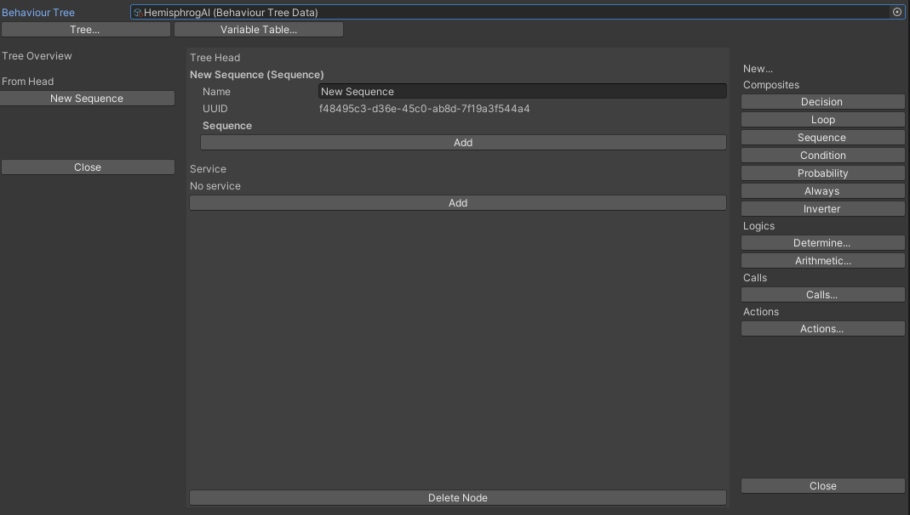
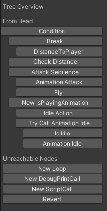
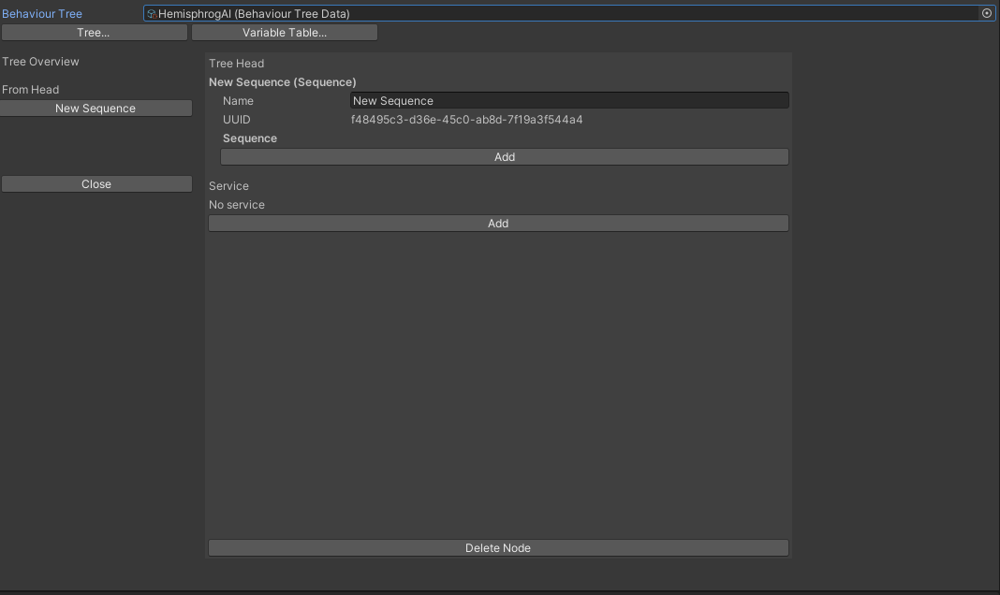
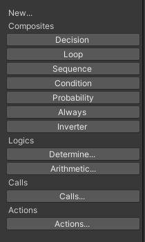
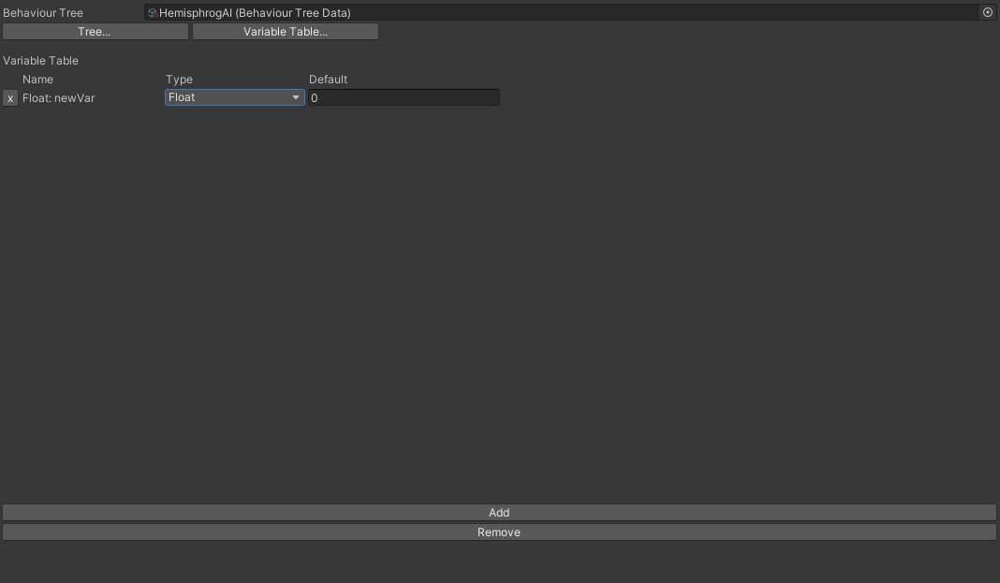
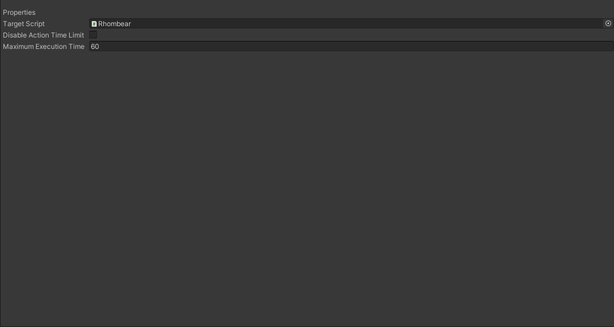
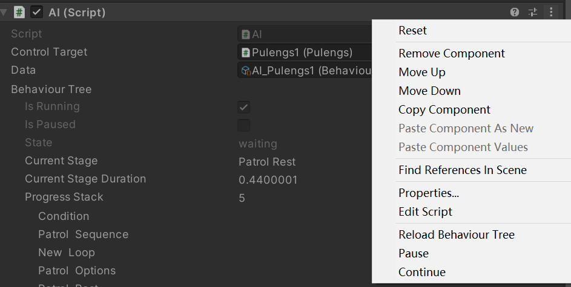

# Aethiumian AI

the documentation of the AI used by the project Library of Meialia (LOM)

([ZH](./DOC_ZH.md)|EN)

This AI system uses the structure of [Behaviour Tree](https://en.wikipedia.org/wiki/Behavior_tree_%28artificial_intelligence,_robotics_and_control%29) (behavior tree)

## Important Concept

### AI (MonoBehaviour)

[Code](Runtime/AI.cs)

`AI` is the runtime component attached to a GameObject. It holds a `BehaviourTreeData`, creates a runtime `BehaviourTree` in `Start()`, and forwards `Update`, `LateUpdate`, and `FixedUpdate` to the tree.

Common fields:

- `BehaviourTreeData data`: the behaviour tree asset to run.
- `MonoBehaviour controlTarget`: the control script used by component-call nodes and component access. `OnValidate()` tries to bind it from the same GameObject according to the tree asset's `targetScript`.
- `awakeStart`: whether to start automatically when the object enters the scene.
- `autoRestart`: whether to start another tree run from `FixedUpdate` after the current run ends.

The AI Inspector and component context menu provide runtime controls such as `Start Behaviour Tree`, `Reload Behaviour Tree`, `Pause`, `Continue`, and `End`.

### BehaviourTreeData (ScriptableObject)

[Code](Runtime/Tree/BehaviourTreeData.cs)

`BehaviourTreeData` is the behaviour tree asset. Create it through `Create/Aethiumian AI/Behaviour Tree`. It stores:

- `headNodeUUID`: root node UUID.
- `nodes`: all serialized nodes.
- `variables`: the tree variable table.
- `targetScript`, `animatorController`, `prefab`: editor helper data.
- `noActionMaximumDurationLimit`, `actionMaximumDuration`, and error-handling settings.

Edit this asset through AI Editor whenever possible. Inspector serialization is mainly for debugging; the asset Inspector provides an `Open AI Editor` button.

### AIEditorWindow (Editor Window)

[Code](Editor/AIEditorWindow/AIEditorWindow.cs)

Open AI Editor from `Window/Aethiumian AI/AI Editor`. The window contains the behaviour tree selector, node/graph views, variable table, property page, and settings page. Opening a specific `BehaviourTreeData` reuses the existing editor window for that tree, while different trees can be open in separate editor windows. Node clipboard content is shared between AI Editor windows so copied nodes can be pasted across trees. When no tree is selected, use `Create New Behaviour Tree` to create an asset. If the Unity Selection is a GameObject, the editor tries to add or reuse its `AI` component and assign the new tree when `AI.Data` is empty.

### BehaviourTree (Runtime Class)

[Code](Runtime/Tree/BehaviourTree.cs)

`BehaviourTree` is the runtime instance. It clones nodes from `BehaviourTreeData`, builds UUID-to-node references, variable tables, and Unity object references, then executes through `NodeCallStack`.

The runtime tree does not execute asset node instances directly. Put runtime state in runtime nodes, variables, or components instead of assuming the asset nodes are mutated.

### NodeCallStack

[Code](Runtime/Tree/BehaviourTree.NodeCallStack.cs)

`NodeCallStack` is the actual execution stack. It advances the current node, receives child returns, waits for actions, handles interruptions, and ends execution. The main behaviour runs on the main stack; services and helper branches such as `Parallel` use additional stacks.

### TreeNode (Class)

[Code](Runtime/Nodes/TreeNode.cs)

`TreeNode` is the base class for all nodes. Node execution uses `State`, which is eventually folded into a boolean return for the parent:

- `true`: the node succeeds or the condition is true.
- `false`: the node fails or the condition is false.
- `Yield` / `NONE_RETURN`: the node has not produced a final result yet, so the tree waits or continues in a later frame.

#### head (root node)

The root node is defined by `BehaviourTreeData.headNodeUUID`. Every tree run starts the main execution stack from this node.

### Variable

Variable definitions live in [VariableType](Runtime/Fields/Variables/VariableType.cs). The main variable types are:

| Type                 | VariableType  | Use                    |
| :------------------- | :------------ | :--------------------- |
| `string`             | `String`      | text                   |
| `int`                | `Int`         | integer                |
| `float`              | `Float`       | decimal number         |
| `bool`               | `Bool`        | state                  |
| `Vector2`            | `Vector2`     | 2D vector              |
| `Vector3`            | `Vector3`     | 3D vector              |
| `Vector4` / `Color`  | `Vector4`     | 4D vector or color     |
| `UnityEngine.Object` | `UnityObject` | Unity object reference |
| `object`             | `Generic`     | arbitrary object       |

`Invalid` and `Node` are hidden/internal types and are usually not selected manually in a normal variable table.

Variables with the same name are not allowed in the same tree, even if they have different types. Initial definitions come from the asset; a runtime `BehaviourTree` builds the variable table for the executing instance. Nodes can read, write, or reference those runtime variables.

Common variable field forms:

| Declaration                | Meaning                                                           |
| :------------------------- | :---------------------------------------------------------------- |
| `float`                    | fixed constant                                                    |
| `VariableField<float>`     | float variable or constant                                        |
| `VariableReference<float>` | float variable reference                                          |
| `VariableField`            | any variable or constant; actual valid types depend on node logic |
| `VariableReference`        | any variable reference; actual valid types depend on node logic   |

Even when a non-generic field allows any variable, the node itself may only support specific types. For example, a boolean arithmetic node cannot use a `string` as a boolean argument.

## Get Started

### Create BehaviourTreeData

There are two common ways:

- In the Project window, use `Create/Aethiumian AI/Behaviour Tree`.
- Open `Window/Aethiumian AI/AI Editor`, then click `Create New Behaviour Tree` when no tree is selected.

When a new asset is created from AI Editor and the current Unity Selection is a GameObject, the editor tries to add or reuse an `AI` component on that object and assign the new tree when `AI.Data` is empty.

### Open AI Editor

You can open it from:

- Unity menu: `Window/Aethiumian AI/AI Editor`.
- Select a `BehaviourTreeData` asset and click `Open AI Editor` at the top of its Inspector.
- Select a GameObject with an `AI` component and click `Open Editor` in the AI component Inspector.

After opening the window, choose the target `BehaviourTreeData` in the top `Behaviour Tree` object field. Reopening the same tree focuses its existing AI Editor window; opening another tree creates or focuses that tree's own window.

### Bind And Run

1. Add an `AI` component to the GameObject that should run the tree.
2. Assign the `BehaviourTreeData` asset to `AI.Data`.
3. If the tree asset sets `targetScript`, make sure the same GameObject has that component; `AI.OnValidate()` tries to bind it to `ControlTarget`.
4. Keep `awakeStart` enabled when the tree should start automatically on scene entry; keep `autoRestart` enabled when the tree should loop after it ends.
5. During Play Mode, use the AI component context menu or Inspector controls to start, reload, pause, continue, or end execution.

### Create The First Tree

1. Select or create a `BehaviourTreeData` in AI Editor.
2. If there is no root node, create a flow node as the head, such as `Sequence`, `Decision`, or `Loop`.
3. Add child nodes to the head in the node editor.
4. Add required variables in the variable table, then bind node fields through `VariableField` or `VariableReference`.
5. Save the asset, enter Play Mode, and observe execution through the AI component or AI Runtime Inspector.

## Introduction to AI Editor

### Node editor



General layout :

|   Left   |   Middle    |     Right      |
| :------: | :---------: | :------------: |
| Overview | Node Editor | Node Selection |

- Overview
- The overview section is an overview of the entire Behaviour Tree. The entire behavior tree will be displayed in a hierarchical manner. You can directly open the node by clicking on a node.

  

  > Unused nodes in the behavior tree cannot be displayed inside the hierarchy, because the hierarchy is generated by the parent-child relationship of the nodes. All unused nodes will be listed separately under the hierarchy section
  >
- Node Editor

  
- Node Selection

  - Node Selection will open when you need to select a Node or create a new Node

    
  - Existed Node: all existing nodes
  - New... creates a new node

### Variable Table

The variable table is used to preview all variables in the behavior tree.



### Property Window

control special properties of this behavior tree



- Target Script The script controlled by the AI
  Specify the script that the AI will control
- Disable Action Time Limit to turn off action time setting
  The behavior tree will not force an action to end if it takes too long
- Maximum Execution Time
  If the behavior tree monitors the execution time of the action, the action that exceeds this time will be forcibly ended

## Create a custom node

If you want to create a custom node, place it under the matching type folder in [AI custom nodes](Custom).

If the custom node does not need to use any namespace other than System, Unity, or Amlos.Module, Aethiumian.AI.PathFinder, you can put the Node in AI/Core/corresponding type

Custom nodes must be implemented by inheriting from these base types of nodes:

- Action
- Arithmetics
- Call
- Determine/ComaparableDetermine
- Flow (customizing new Flow nodes is strongly NOT recommended)
- Service

Please review the special requirements for each type of node

A example node implementation: [Wait(Action)](Core/Actions/Wait.cs)

```c#
//if there is no reference other than System, Unity, Amlos.Module, Aethiumian.AI.PathFinder, you can put the Node in the Core
using Amlos.Module;
using System;
using UnityEngine;
namespace Aethiumian.AI
{
    [Serializable]
    //Set the Tip in AI Editor
    [NodeTip("let Behaviour Tree wait for given time")]
    public sealed class Wait : Action
    {
    //Wait's time measurement method, real time or frame number
        public enum mode
        {
            realTime,
            frame
        }

        public Mode mode;
        public VariableField<float> time;
        private float currentTime;

        // Action.BeforeExecute()
        // Initialize before each action starts, reset currentTime to 0
        public override void BeforeExecute()
        {
            currentTime = 0;
        }

        // Action.FixedUpdate()
        // Each update update time, if the expected waiting time has been reached, end the node
        public override void FixedUpdate()
        {
            switch (mode)
            {
                caseMode.realTime:
                    currentTime += Time.fixedDeltaTime;
                    if (currentTime > time)
                    {
                        //Use End(bool) to return the result of the execution
                        End(true);
                    }
                    break;
                case Mode.frame:
                    currentTime++;

                    if (currentTime > time)
                    {
                        //Use End(bool) to return the result of the execution
                        End(true);
                    }
                    break;
                default:
                    break;
            }
        }

    }
}


```

## Debug

These are some helpful tips of debuging in AI�?

1. AI Component Menu

   

   You can access the menu by click the three dots on the up-right corner

   - Reload Behaviour Tree

     If you made some changes to the behaviour tree in runtime, it will not reflect to the tree. But you can use this reload method to reload the behaviour tree. So you don't have to restart the game
   - Pause

     Pause the execution of the behaviour tree, which the behaviour tree will stop in its current stage
   - Continue

     Continue the execution of the behaviour tree

2. DebugPrint

   [See DebugPrint reference](#debugprint)

   Use DebugPrint node to print the variables/messages to the game console

3. Lovely Visual Studio and break point

   especially useful if you are encountering crash of the engine (which could be the internal error of Unity or the AI system itself)

## Reference

This section is the documentation for all nodes

### base type

#### TreeNode (base class)

base class for all nodes

````c#
//When the instance of the behavior tree is generated, initialize this node
public abstract void Initialize();

//execute the node
public abstract State Execute();

//Receive the return value of its own child node
public virtual State ReceiveReturnFromChild (bool @return);

//pass the return value to its own parent node
public virtual void End(bool @return);

//stop the execution of this node
public virtual void Stop();

//List a node as the next node to execute
public void SetNextExecute (TreeNode child);

//Return all direct child nodes of this node
public List<UUID> GetAllChildrenUUIDs();
````

`SetNextExecute(child)` is a terminal handoff. Return its `NONE_RETURN` immediately; do not call it and then return another `State` from the same execution turn.

#### NodeProgress (parameters for ObjectCall nodes and ObjectAction nodes)

Used to control the execution state of a node. In ObjectAction and ObjectCall, if the specified method has this parameter, the method can control the tree through NodeProgress.

> ComponentAction and ComponentCall are legacy nodes that are migrating to ObjectAction and ObjectCall. Legacy nodes remain for compatibility and upgrade paths; new behaviour trees should prefer ObjectAction/ObjectCall.

##### method

````c#
//Pause the execution of Behaviour Tree
public void Pause();

//Continue the execution of Behaviour Tree
public void Resume();

//End the node execution in Behaviour Tree
public void Complete(bool value);

//When the monoBehaviour is destroyed, end the execution of the node in the Behaviour Tree
public void CompleteWhenDestroyed(UnityEngine.Object obj, bool value = true);
public void CompleteWhenCanceled(CancellationToken token, bool value = true);
public void CompleteWhenCompleted(Task task, bool value = true, bool canceledValue = false);
public void CompleteWhenFalse(Func<bool> condition, bool value = true);
````

##### Example

````c#
//example: use ObjectCall to execute the Attack method in the script
public void Attack(NodeProgress progress){
    if (...){
        //Make the ObjectCall node return false
        progress.Complete(false);
    }
    //Make the ObjectCall node return true
    else progress.Complete(true);
}
````

> Don't write two methods with the same name in the script, otherwise the AI will not be able to determine which method it is.

````c#
public void MethodName (NodeProgress node);
public bool MethodName ();//ObjectCall only
public void MethodName ();
//It is illegal when the above methods appear at the same time
````

### Action Node (AI/Actions)

Performing an action sometimes requires the cooperation of an AI -controlled script

#### Action (base class)

The parent class of the action type node. All Actions cannot Override `Execute`.

````c#
//If you need to implement initialization before the Execute stage, you need to Override
public virtual void BeforeExecute();

//Executed after BeforeExecute and only execute once when the action start execute
public virtual void ExecuteOnce();

//you cannot override the method Execute() of an action
//otherwise you might forget to setup the delegate calls the 3 Updates
public sealed override void Execute();

//At the same time, the execution of all Actions is implemented through the following two different Updates

//Executed at MonoBehaviour.Update()
public virtual void Update();

//Executed at MonoBehaviour.LateUpdate()
public virtual void LateUpdate();

//Executed at MonoBehaviour.FixedUpdate()
public virtual void FixedUpdate();
````

#### Movement (base class)

> Note: All node that inherit from this class is not considered as part of AI Core, because it repquires more than `namespace Aethiumian.AI` but also other namespaces

Parent class for nodes of movement type.

Movement node is only responsible for moving to its final destination (the destination is determined by the mode)

All Movements cannot override `Update`and `LateUpdate`, because movement involves physics, and the physics system is implemented in FixedUpdate.

##### `enum Movement.Behaviour` _

mobile performance

|     Members      |        Introduction         |
| :--------------: | :-------------------------: |
|   towardPlayer   |   Rush toward the player    |
|      wander      |   Wander around aimlessly   |
| fixedDestination | Move to a fixed destination |

##### `enum Movement.PathMode`

path mode

| Members |                  Introduction                  |
| :-----: | :--------------------------------------------: |
| simple  | Approaching the destination in a straight line |
|  smart  | Find the path by using a pathfinding algorithm |

> the entity may not necessarily reach the destination if `simple` mode is used as the movement mode

##### `enum Movement.WanderMode`

wandering mode

|     Members      |        Introduction        |
| :--------------: | :------------------------: |
|   selfCentered   |     Rush to the player     |
| absoluteCentered | Wandering around aimlessly |

- Parameters
- `Behaviour type`: the behavior of the movement. See the `Movement.Behaviour` section above.
- `PathMode path`: The path mode for movement. See the `Movement.PathMode` section above.
- `VariableField<int> maxIdleDuration` : The maximum time the entity stays in place when moving, beyond this time, the entity will be considered unable to reach the destination due to force majeure and return false
- Wandering:
- `WanderMode wanderMode` : entity wandering mode. See the `Movement.WanderMode` section above.
- `VariableField<Vector2> centerOfWander` : the absolute center of the selected point when the entity is wandering
- `VariableField<float> wanderRadius` : the wandering range, the maximum distance the entity moves each time

#### Fly

flight move

- Parameters
  - `VariableField<float> speed`: flight speed
  - `VariableField<float> arrivalErrorBound`: When the entity is closer to the destination than this distance, the node will consider it has arrive the destination
  - `VariableField<float> flexibility`: the flexibility of the entity, higher the more flexible
- Return
  - `true` : when the entity reaches the destination
  - `false` : When the entity stays for too long due to force majeure, or the entity cannot find a way to the destination

#### Jump

jump move

- parameters

  - `VariableField<float> jumpHeight`: The jump height of the entity
  - `VariableField<float> arrivalErrorBound`: When the entity is closer to the destination than this distance, the node will consider it has arrive the destination
  - `VariableField<float> jumpInterval`: The time between two jumps
- Return

  - `true` : when the entity reaches the destination
  - `false` : When the entity stays for too long due to force majeure, or the entity cannot find a way to the destination

#### Walk

walk and move

- Parameters

  - `VariableField<float> speed`：horizontal movement speed
  - `VariableField<float> jumpHeight`：The jump height of the entity, when the entity must jump to pass obstables
  - `VariableField<float> xArrivalErrorBound`: aceptable marginal error on x axis
- Return

  - `true` : when the entity reaches the destination
  - `false` : When the entity stays for too long due to force majeure, or the entity cannot find a way to the destination

#### Idle

Make the entity stop, if Idle is not used, the entity will only stop by itself through Physics2D friction or collision

- Return
  - `true` : always
  - `false` : -

#### ObjectAction

[Code](Runtime/Nodes/Actions/ObjectAction.cs)

Legacy object action node that executes a method on a selected object.

> ComponentAction is obsolete. One-shot action-capable ObjectAction/ComponentAction nodes can be upgraded to FunctionAction.
> Repeat action calls through Update or FixedUpdate are deprecated. Use Loop with variables for repeated behavior, and use FunctionAction for one-shot cross-frame method work.

- Parameters
  - `string methodName` the name of the method to be executed in the script

    > The way to find this method is special; refer to [NodeProgress parameters for object calls and actions](#nodeprogress-parameters-for-objectcall-nodes-and-objectaction-nodes).
    >
  - `ActionCallTime actionCallTime`The time when the method was executed, UpdateEndType must be `UpdateEndType.byMethod`

| ActionCallTime | Explanation                                  |
| :------------- | :------------------------------------------- |
| Update         | Executed at `MonoBehaviour.Update ()`        |
| FixedUpdate    | Executed when `MonoBehaviour.FixedUpdate ()` |
| Once           | Executed only once at the beginning          |

> If ActionCallTime is specified as `ActionCallTime.Once`

- `UpdateEndType endType` The way the Action ends

| UpdateEndType | Explanation                                                                                |
| :------------ | :----------------------------------------------------------------------------------------- |
| byCounter     | End the Action when `count` is executed                                                    |
| byTimer       | End the Action after `duration` times                                                      |
| byMethod      | End the Action from the target method, `Task`, `IEnumerator`, or `NodeProgress.Complete()` |

> If the Action ends byMethod and the target method does not return `Task` / `IEnumerator` / `Awaitable`, ObjectAction needs `NodeProgress.Complete()` to end; otherwise the Action will not end.

- `VariableField<float> duration` The duration of the Action (time)
- `VariableField<int> count` The duration of the Action
- Return

  - `true` : when call is complete
  - `false` : when ObjectAction cannot find or execute the function

#### FunctionAction

[Code](Runtime/Nodes/Actions/FunctionAction.cs)

Execute a selected function as an Action. FunctionAction uses the same function picker and receiver model as FunctionCall, but it runs through the Action lifecycle and waits for cross-frame completion.

> FunctionAction only supports action-capable methods: methods returning `Task`, `Task<T>`, `IEnumerator`, Unity 2023+ `Awaitable` / `Awaitable<T>`, or methods whose first parameter is `NodeProgress`.
> `CancellationToken` is only supported as the first parameter of awaitable methods. Runtime-supplied `NodeProgress` and `CancellationToken` parameters are injected by the node and are not edited as ordinary variables.

- Parameters
  - `FunctionReference function` selected function and receiver.
  - `List<Parameter> parameters` editable method parameters, excluding runtime-injected action control parameters.
  - `VariableReference result` receives `Task<T>` / `Awaitable<T>` completion values or direct non-void return values.
- Return
  - `true` : when the function completes successfully, or when the returned value is not `bool`
  - `false` : when the selected function cannot run, is cancelled, fails, or returns `false`

### Arithmetic node (AI/Arithmetic)

Perform operations on variables in the behaviour tree
The goal of this node type is trying to resolve issues with variable operations / transfer non-boolean result accross the behaviour tree. So in general, the parameter of Arithmetic nodes should be only `Variables` or constant [See also: Variables](#variable)

```c#
//initialize the node
public override void Initialize();

//Execute the node
public override void Execute();

//you cannot override End or Stop for the node, because Arithmetic nodes are there to provide calculation only
public sealed override void End();
public sealed override void Stop();
```

#### Arithmetic (base class)

[code](Arithmetic/Arithmetic.cs)

#### Absolute

absolute value
absolute value

- Parameters

  - `a` input value (int/float)
  - `result` return value : |a|
- Return

  - `true` : Completion of operation
  - `false`:`a` is not an int/float

#### Add

perform addition of two int/float
addition

perform concatenation on at least one String
concatenation

- Parameters

  - `a` input value (int/float/String)
  - `b` input value (int/float/String)
  - `result` return value : a+b
- Return

  - `true` : Completion of operation
  - `false`:`a` or `b` has a bool

#### And

AND gate
logical and

- Parameters

  - `a` input value (mandatory bool)
  - `b` input value (mandatory bool)
- Return

  - the value of `a` AND `b`

#### Arccosine

Inverse of cosine
arccos

- Parameters

  - `a` input value (int/float)
  - `result` return value : arccos (a)
- Return

  - `true` : Completion of operation
  - `false`:`a` is not in domain or `a` is not an int/float

#### Arcsine

Inverse operation of sine
arcsin

- Parameters

  - `a` input value (int/float)
  - `result` return value : arcsin (a)
- Return

  - `true` : Completion of operation
  - `false`:`a` is not in domain or `a` is not an int/float

#### Arctangent

Inverse operation of tangent
arctan

- Parameters

  - `a` input value (int/float)
  - `result` return value : arctan(a)
- Return

  - `true` : Completion of operation
  - `false`:`a` is not an int/float

#### Arctangent2

Inverse operation of tangent (handling special case : tangent = ±�?
arctan

- Parameters

  - `a` input value (int/float)
  - `b` input value (int/float)
  - `result` return value : arctan(a/b)
- Return

  - `true` : Completion of operation
  - `false`: `a` and `b` are both 0, or `a` and `b` are not int/float

#### Compare

compare the size of two variables

- Parameters

  - `a` input value (int/float)
  - `b` input value (int/float)
  - `Mode` input value : less(<), lessOrEquals (<=), equals(=), greaterOrEquals (>=), greater(>)
- Return

  - `true`: `a` and `b` are both int/float and the comparison result is returned
  - `false`: `a` or `b` are not int/float

#### Copy

copy a value

- Parameters

  - `from` input value (int/float/String/bool)
  - `to` return value : to = from
- Return

  - `true` : copy complete

#### Cosine

cosine
cos

- Parameters

  - `a` input value (int/float)
  - `result` return value : cos(a)
- Return

  - `true` : Completion of operation
  - `false`:`a` is not an int/float

#### Divide

Perform integer division on two ints
integer division
perform real division on at least one float
real number division

- Parameters

  - `a` input value (int/float)
  - `b` input value (int/float)
  - `result` return value : a/b
- Return

  - `true` : Completion of operation
  - `false`: `b` is 0, or `a` and `b` are not int/float

#### Equals

are two variables equal

- Parameters

  - `a` input value (int/float/String/bool)
  - `b` input value (int/float/String/bool)
- Return

  - `true`: the values of `a` and `b` are equal
  - `false`: the values of `a` and `b` are not equal or `a` and `b` are not the same type of variable

#### GetValue

get the value of a variable

- Parameters

  - `a` input value (int/float/String/bool)
  - `result`return value : the value of `a`
- Return

  - `true` : Completion of operation

#### Multiply

perform multiplication on two int/float: multiplication

Perform String multiplication for a String and an int: Repeat this String several times

- Parameters

  - `a` input value (int/float/String)
  - `b` input value (int/float/String)
  - `result` return value : a*b
- Return

  - `true` : Completion of operation
  - `false`: `a` and `b` are not two int/float values or a String and an int

#### Or

OR gate
logical or

- Parameters

  - `a` input value (mandatory bool)
  - `b` input value (mandatory bool)
- Return

  - the value of `a`OR `b`

#### SetValue

assign a value to a variable

- Parameters

  - `a` input value (int/float/String/bool)
  - `value`input value : the value assigned to `a`
- Return

  - `true` : Completion of operation
  - `false`: the value of `value`cannot be assigned to `a`

#### Sine

Sine
sin

- Parameters

  - `a` input value (int/float)
  - `result` return value : sin(a)
- Return

  - `true` : Completion of operation
  - `false`:`a` is not an int/float

#### SquareRoot

Prescribing
sqrt

- Parameters

  - `a` input value (int/float)
  - `result` return value : √a
- Return

  - `true` : Completion of operation
  - `false`:`a`<0 or `a` is not an int/float

#### Subtract

subtraction

Only allows int, float, Vector2, and Vector3

- Parameters

  - `a` input value (int/float)
  - `b` input value (int/float)
  - `result` return value : ab
- Return

  - `true` : Completion of operation
  - `false`: `a` and `b` are not int/float

#### Tangent

Tangent
tan

- Parameters

  - `a` input value (int/float)
  - `result` return value : tan(a)
- Return

  - `true` : Completion of operation
  - `false`:`a` is not an int/float

#### VectorComponent

[Code](Nodes\Arithmetics\VectorComponent.cs)

Get a component

- Parameters

  - `VariableField vector` Input Vector
- Return

  - `true` : Complete
  - `false` : Failed to get component

### Execution node (AI/Calls)

#### Call (base class)

[Code](Runtime/Nodes/Calls/Call.cs)

The goal of having this node type is for controlling some other component/the target component. These type of code can execute some functions such like switch animations, execute a method on controlling component

> Call is the base class for execution nodes, not the deprecated legacy call node. Use ObjectCall for ordinary object method calls; ComponentCall is the legacy node migrating to ObjectCall.

```c#
public class Call : TreeNode {
  //Nothing sepcial about node call, same as its parent
}
```

#### ObjectCall

[Code](Runtime/Nodes/Calls/ObjectCall.cs)

Execute the specified method in the script

> ComponentCall remains for compatibility and upgrade paths for old assets; new behaviour trees should use ObjectCall. ObjectCall targets an object through `VariableReference object` and resolves instance methods by `type`.
> ObjectCall is an instant execution node: it reads the direct return value, `bool` controls success/failure, and `null` or any other value is treated as success. It does not wait for `Task` or `IEnumerator`; use FunctionAction for cross-frame work.

- Parameters `string methodName` the name of the method to be executed in the script

  > The way to find this method is special; refer to [NodeProgress parameters for object calls and actions](#nodeprogress-parameters-for-objectcall-nodes-and-objectaction-nodes).
  >
- Return

  - `true` : when call is complete
  - `false` : when ObjectCall cannot find or execute the function

#### Instantiate

[Code](Core/Calls/Instantiate.cs)

Generate an instance of Prefab

- Parameters
- `AssetReference<GameObject> original`: Prefab
- `ParentMode parentOfObject`: the parent of the new GameObject

| ParentMode |                                                                                     |
| :--------: | :---------------------------------------------------------------------------------: |
|    self    |        The newly generated Game Object will be under the current Game Object        |
|   parent   | The newly generated Game Object is under the same parent as the current Game Object |
|   global   |           The newly generated Game Object will be directly in the global            |

- `OffsetMode offsetMode`: The position of the new GameObject

  |  OffsetMode  |                                                                           |
  | :----------: | :-----------------------------------------------------------------------: |
  |    center    |       The newly generated GameObject will be located at the center        |
  | centerOffset | The newly generated Game Object will be located at the center + an offset |
  | worldOffset  |             The newly generated Game Object will be at offset             |

- `Vector3 offset`: offset
- Return

  - `true` : if prefab is valid
  - `false` : if prefab is invalid

#### DebugPrint

[Code](Core/Calls/DebugPrint.cs)

A Debug-only node that prints message to the console

Use this Node to print values of variables in the behaviour tree

- Parameters:
  - `VariableField message`: the variable/constant this node should print to the game console
  - `bool returnValue`: the return value of this node (in the behaviour tree)

### Determines node (AI/Determines)

Nodes that determine about the situation in the game scene

There are 2 different type of determine, one is the `Determine`, and the other one is the `ComparableDetermine`.

The `Determine` can only make assertion, for example, the return of Determine Node `IsPlayingAnimation` can only be `true` or `false`.

The `ComparableDetermine` can not just the assertion, but also store the data it get (player position etc) and compare the current value and expected value (if they are comparable).

> all Determines should not have any child nodes

#### Determine (base class)

[Code](Determines/Determine.cs)

The parent class of the node of the determine type

```c#
public abstract class Determine : DetermineBase{
  //the result to be stored, is determine is set to store result
  public VariableReference<bool> result;

  //the method to override to impliment the node
  public abstract bool GetValue();

  //cannot override execute because the execution is defined already
  public sealed override void Execute();
}

```

#### ComparableDetermine `<T>` (base class)

[Code](Core/Determines/Determine.cs)

The parent class of the node of the determine type

```c#
public abstract class ComparableDetermine<T> : DetermineBase {
  //whether to compare the data
  public bool compare = true;
  //the compare sign (>, =, < etc)
  public CompareSign mode;
  //the expect value
  public VariableField<T> expect;
  //the result to be stored, is determine is set to store 
  public VariableReference<T> result;
  //the compare result to be stored, is determine is set to store 
  public VariableReference<bool> compareResult;

  //the method to override to impliment the node
  public abstract T GetValue();

  //cannot override execute because the execution is defined already
  public sealed override void Execute();
}
```

#### DistanceToPlayer

> Note: All node that inherit from this class is not considered as part of AI Core, because it repquires more than `namespace Aethiumian.AI` but also other namespaces

[Code](Core/Determines/DistanceToPlayer.cs)

- Parameters
- Return
  - `true` :
  - `false` :

#### IsPlayingAnimation

[Code](Core/Determines/IsPlayingAnimation.cs)

- Parameters
- Return
  - `true` :
  - `false` :

### Flow node (AI/Flow)

Flow nodes are suitable for the execution of the control tree

#### Rollback

Roll back the current executing stack to a referenced node.

- Parameters
  - `RawNodeReference stopAt`
    the node to return to in the current stack
  - `bool yield`
    whether to wait one frame after rolling back
- Return
  - `NONE_RETURN` or `Yield`: rollback succeeded and the current stack now points to the target node
  - `false`: `stopAt` is empty, or the target is not in the current stack

`Rollback` can only operate on the current executing stack. When it runs in a Service routine, it rolls back only the current service stack. It no longer modifies the main stack or a Service host stack. Use `Restart` when the current AI should reload its behaviour tree; use `Interrupt` or `Timeout` when a Service should end its host node with an explicit result.

#### Restart

Reload the current AI behaviour tree.

- Parameters
  - none
- Return
  - `NONE_RETURN`: the current behaviour tree has been reloaded, so the old stack should not return a result to its parent

#### Always

return a fixed value/variable

- Parameters
  - `TreeNode node`
    execution nodeThe node will always be executed But his return value will be ignored
  - `VariableField <bool > returnValue`
    The return value to be returned by the node
- Return
  - `true`: when returnValue is `true`
  - `false`: when returnValue is `false`

#### Condition

Determine which node to execute according to Condition

- Parameters
  - `TreeNode condition`
    condition node
  - `TreeNode trueNode`
    execution node
    Executed when the condition node execution result is True
  - `TreeNode falseNode`
    execution node
    Executed when the condition node execution result is False
- Return
  - `true`: returns `true` when executing the node
  - `false`: returns `false` when executing the node

#### Decision

When the execution result of one of the child nodes is true, the node ends

- Parameters
  - `List< TreeNode >events`
    all child nodes that will be tried
    All nodes in the list will be executed in order If the return value of the currently executing node is `false`, the next node in Events will be executed until the currently executing child node scope value is `true`
- Return
  - `true`: when any child node returns `true`
  - `false`: no node returns `true`

#### Inverter

Invert the return value of a node

- Parameters
  - `TreeNode node`
    execution node
- Return
  - `true`: returns `false` when executing the node
  - `false`: returns `true` when executing the node

#### Loop

Loop through child nodes

> Attention! Although the Loop can be completed instantaneously, when the Loop has no events, the node will pause for 1 frame to prevent the condition from being executed infinitely. When a Loop is in the Service, no event will return false directly to the Loop.
> According to the above characteristics, Loop can also be used as Wait While.

- Parameters
- `LoopType  loopType`
  Loop type
  There are three types :
  - For : Fixed number of cycles
  - While : loop when `condition`returns `true`
- DoWhile : execute a loop first, and continue the loop when `condition`returns `true`
- `VariableField <int> loopCount (For-Loop only)`
  number of executions
- `TreeNode condition (While-Loop/DoWhile -Loop only)`
  condition node
- `List< TreeNode >events`
  child node list
- Return
  - `true`: almost always
  - `false` : only when the node appears in the Service without any event

#### Pause

Pause behavior tree execution

Not sure why you want to do this, but you can

- parameters
  - None
- return
  - None, the behavior tree will be directly paused and never return

#### Probability

Randomly select a child node and execute it, the probability of the byte point being selected is based on the specified weight

- Parameters
  - `List<EventWeight> events`
    All possible executions of child nodes and the weights at which the child nodes are selected
  - `EventWeight`
    - `weight` node is selected weight
    - `node` node
    - `Weight` the weight performed by this node
- Return
  - `true`: Returns True when the child node node is executed
  - `false` : Returns False when the child node node is executed

#### Parallel

Run multiple child branches at the same time and wait for them according to the selected mode.

- Parameters
  - `NodeReference[] events`
    child branches to start
  - `Mode mode`
    - `WaitAll`: finish after all child stacks stop
    - `WaitAny`: finish after any child stack stops
- Return
  - `true`: when the selected wait mode is resolved and child stacks are cleaned up
  - `false` : only when exception handling returns failure

#### Sequence

All child nodes are executed in order, regardless of each child node's return value.

- Parameters
  - `List<TreeNode> events`: all child nodes that will be tried
    Events will be executed sequentially Regardless of the return value of the child node, the Sequence will continue the execution of the next node
- Return
  - `true`: when any child returns `true`
  - `false` : when `events` is empty or every child returns `false`

#### Wait

Let Behaviour Tree wait for the specified time before executing the next step

- Parameters
- `Mode mode` : wait time mode

|   Mode   |                            |
| :------: | :------------------------: |
| realTime | According to real time (s) |
|  frame   |          By frame          |

- `VariableField <float> time` : time
- Return
  - `true` : always
  - `false` : -

### Service Node (AI/Service)

The service node can control the node execution process

> Service branches should stay short and deterministic. Long-running Action nodes can delay service timing and interfere with the host node lifecycle.

Service nodes are not connected to the main tree as normal flow children. They are attached to a service host node's `services` list instead. Flow and Action nodes are service hosts; instant nodes such as Call, Determine, Arithmetic, and Boolean do not host services. A Service node can also host nested services: at runtime the tree scans the main stack and all active service stacks, registers a service node's own `services` when that service stack starts, and continues polling them during `BehaviourTree.FixedUpdate()`.

A nested service follows the lifetime of its host node. When the host node is popped from its execution stack, its services are unregistered and ended.

#### Break

Break the service host stack when the condition succeeds.

- Parameters
  - `ReturnType returnTo`
    whether to break back to the service host itself or to its parent
  - `TreeNode condition`
    condition node
    When the condition result is true, the behavior tree will return to the node to which the Service is bound
    The behavior tree will re-execute the node to which the Service is bound, that is, the node can reset the behavior tree
- Return
  - `true`: always
  - `false` :-

#### Interrupt

Interrupt the host node when the condition returns true.

- Parameters
  - `TreeNode condition`
    condition node. When the condition is `Boolean`, Interrupt reads the bool source directly without starting a condition branch; other condition nodes execute as a service branch.
  - `ReturnResult result`
    result returned to the host node's parent after interrupting the host node
- Return
  - `true`: always
  - `false` :-

#### Branch

Run a new branch as a service branch of the current stack.

- Parameters
  - `TreeNode subtreeHead`
    the head node of the branch
- Return
  - `true`: when the branch starts and finishes successfully
  - `false` : when there is no valid branch head or the branch fails

#### Timer

Update a float variable every service tick.

- Parameters
  - `VariableReference<float> updatingVariable`
    the variable to decrement
  - `Timing timing`
    `FixedDeltaTime` or `FixedUnscaledDeltaTime`
- Return
  - `true`: -
  - `false` : -

#### Update

Repeat executing a subtree as a service.

- Parameters
  - `int interval`
    minimum fixed-update interval between service executions
  - `VariableField<bool> forceStopped`
    whether the routine should start again even if the old one is not done yet
  - `TreeNode subtreeHead`
    the head node of the subtree
- Return
  - `true`: when the subtree starts and finishes successfully
  - `false` : when there is no valid subtree head or the subtree fails

### Attribute Attribute

#### NodeTipAttribute [code](Core/Attributes/NodeTipAttribute.cs)

Add a comment to a node to display in AIEditor

#### AllowServiceCallAttribute

Allow the Service routine to execute this node

#### DoNotReleaseAttribute

Forbid the node to become a officially released node (forbid the node to appear in the create node menu)

#### TypeExcludeAttribute

Restrict the type of the generic variable, the types in the parameter will be excluded

#### TypeLimitAttribute

Restrict the type of generic variables, allowing only the types in the parameter to be selected

### Editor area `namespace Aethiumian.AI.Editor`

> Attention! All scripts under this namespace are only allowed to be used in the Editor, which means that they cannot exist in the game after the game is compiled.

#### CustomNodeDrawerBase [code](Editor/CustomNodeDrawers.cs)

all NodeDrawers, providing various tools to draw a node

#### DefaultDrawer [code](Editor/DefaultNodeDrawer.cs)

Default Node Painter

> When a node does not have a drawer set, the node is drawn by the default drawer

#### CustomNodeDrawerAttribute [code](Editor/CustomNodeDrawerAttribute.cs)

Customize the Attribute of Node Drawer, for example :

````c#
[CustomNodeDrawer(typeof(Always))]
public class AlwaysDrawer : CustomNodeDrawerBase
{
...
}
````

custom draw script responsible for drawing the node Always

#### AIEditor [code](Editor/AIEditor.cs)

AI Editor window
