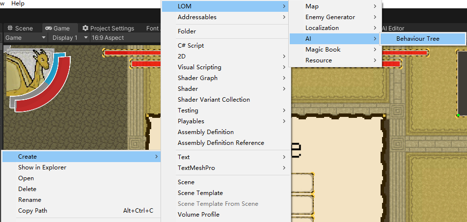
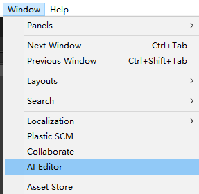
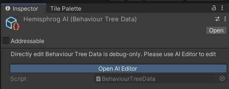
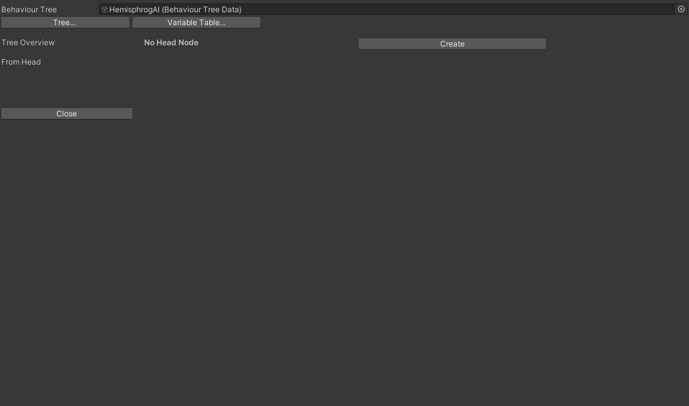
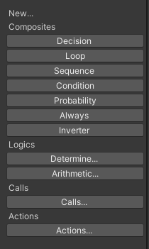
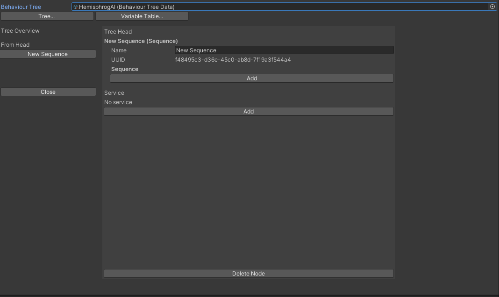
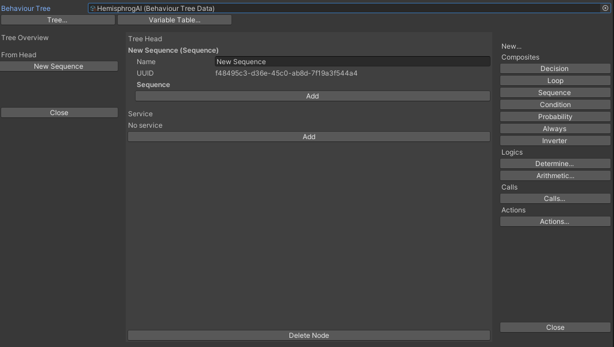
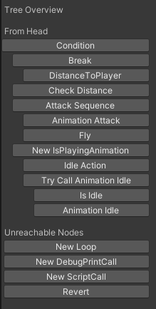
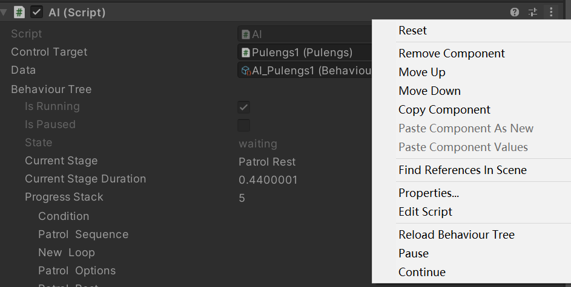
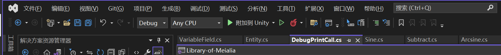

# Aethiumian AI

这是项目 Library of Meialia (LOM) 所使用的AI的文档

(ZH|[EN](./DOC_EN.md))

本AI系统使用 [Behaviour Tree](https://en.wikipedia.org/wiki/Behavior_tree_%28artificial_intelligence,_robotics_and_control%29) (行为树) 的结构

# 重要概念

## AI (MonoBehaviour)

[Code](AI.cs)
AI Component为运行AI的脚本,给一个 `gameObject`添加一个AI 并且给AI指定一个 `BehaviourTreeData` 以运行指定的行为树

## BehaviourTreeData (ScriptableObject)

[Code](BehaviourTreeData.cs)
Behaviour Tree Data 储存一个AI运行所需要的数据,通过目录 `Create/Aethiumian of Meialia/AI/Behaviour Tree`创建
请通过 `AI Editor` 编辑AI

> 你可以直接在Unity Inspector中打开一个Behaviour Tree Data,但是你只能看到被序列化后的每个节点,不推荐直接对序列化的数据进行编辑.
>
> 如果你在Inspector中打开Behaviour Tree Data, Inspector的最上面将警告你不要直接编辑该Asset的内容,并且会有一个Button可以直接打开AI Editor

## AIEditor (Editor Window)

[Code](Editor/AIEditor.cs)
AI Editor 为AI 编辑窗口,由节点编辑器与变量表组成

## BehaviourTree (Class)

[Code](BehaviourTree.cs)
`class BehaviourTree` 为AI的核心部分,负责整个AI的流程控制

当行为树从未被执行(游戏开始)或者执行结束,AI Component将在下一次Update前开始新一轮的行为树的执行

## TreeNode (Class)

[Code](TreeNode.cs)
节点的基类型，每一个节点都告诉AI需要在这个节点的时候做什么 `<br>`
节点的执行方式由其子节点的返回值控制,行为树的每一节点在执行后将给它的父节点一个 `bool`返回值:

- `true` 当节点执行结束 结果为真
- `false` 当节点执行结束 结果为假

如果节点没有返回值,Behaviour Tree 将一直等待该节点提供返回值

### 头(根节点)

根节点为整个行为书的入口.行为树每次执行时都将从这一节点开始执行

## Variable 变量

当前支持六种不同的变量

|          类型          | [VariableType](Variable/Variable.cs) |         作用         |
| :--------------------: | :-------------------------------: | :-------------------: |
|       `string`       |        VariableType.String        |           -           |
|        `bool`        |         VariableType.Bool         |       记录状态       |
|       `float`       |        VariableType.Float        |       记录小数       |
|        `int`        |         VariableType.Int         |       记录整数       |
|      `Vector2`      |       VariableType.Vector2       |           -           |
|      `Vector3`      |       VariableType.Vector3       |           -           |
| `UnityEngine.Object` |     VariableType.UnityObject     | 记录Unity内部的Object |
|       `object`       |       VariableType.Generic       |   记录任意类型变量   |

在同一个AI中不允许出现同名的变量,即使类型不同.

AI内的部分变量允许直接进行转化：

|  目标类型\来源类型  | VariableType.String |         VariableType.Bool         |    VariableType.Float    |   VariableType.Int   |    VariableType.Vector2    |    VariableType.Vector3    |
| :------------------: | :-----------------: | :-------------------------------: | :----------------------: | :------------------: | :------------------------: | :------------------------: |
| VariableType.String |          -          | 转化为 `true`/`false`的字符串 | 转化为 `float`的字符串 | 转化为 `int`字符串 | 转化为 `Vector2`的字符串 | 转化为 `Vector3`的字符串 |
|  VariableType.Bool  |          x          |                 -                 |        float != 0        |       int != 0       |      vector2 != (0,0)      |     vector3 != (0,0,0)     |
|  VariableType.Float  |          x          |           bool ? 1 : 0           |            -            |      (float)int      |             x             |             x             |
|   VariableType.Int   |          x          |           bool ? 1 : 0           |        (int)float        |          -          |             x             |             x             |
| VariableType.Vector2 |          x          |       bool ? (1,1) : (0,0)       |            x            |          x          |             -             |      (Vector2)vector3      |
| VariableType.Vector3 |          x          |     bool ? (1,1,1) : (0,0,0)     |            x            |          x          |      (Vector3)vector2      |             -             |

> 注意:
>
> `VariableType.UnityObject` 与 `VariableType.Generic` 在不确定类型的情况下无法进行 Cast
>
> 所有的变量的类型与初始值都在行为树的实例生成前就已经生成,变量的类型不可以在运行的时候更改.

Variable在一个Node中的种类:

|            |        `VariableReference`        |                  `VariableField`                  |  - (无类型)  |
| :---------: | :---------------------------------: | :-------------------------------------------------: | :----------: |
|   `<T>`   | 该位置可以是一个类型为<`T`>的变量 | 该位置可以是一个类型为<`T`>的变量或**常量** |      -      |
| Non-Generic |     该位置可以是任意类型*的变量     |     该位置可以是任意类型*的变量或**常量**     | 该类型的常量 |

|             声明             |           解释           |
| :--------------------------: | :----------------------: |
|          `float`          |        float常量        |
|   `VariableField<float>`   |     float变量或常量     |
| `VariableReference<float>` |        float变量        |
|      `VariableField`      | **任何**变量或常量 |
|    `VariableReference`    |    **任何**变量    |

> 事实上,即使Non-Generic的位置允许给任意类型的变量,但是实际情况要根据节点运算时允许的类型来进行.例如,Boolean运算 `Or`的节点的参数不可以给出一个string:这样是不受支持的.

# 开始使用

先从此处创建BehaviourTreeData:



然后,在Window目录底下找到AI Editor并打开.在Behaviour Tree中选中你刚刚创建的Behaviour Tree Data或者直接打开刚刚创建的文件,通过inspector中的警告信息下方的Open AI Editor打开



在打开新建的BehaviourTreeData后你将看到这样的界面:



此时树没有头部节点,点击No Head Node边上的创建节点.右侧会弹出这样的窗口



选择你想要创建的节点(举例:Sequence),点击.这个节点将被创建并且设置为头节点



这样基础设置就完成了.

# AI Editor 介绍

## 节点编辑器



大致布局:

|   Left   |   Middle   |     Right     |
| :------: | :---------: | :------------: |
| Overview | Node Editor | Node Selection |

- Overview

  - overview部分是整个Behaviour Tree的总览图,整个行为树将以一个hierarchy的方式显示.可以通过点击一个节点直接打开该节点。

  

  > 行为树中未被使用的节点无法显示在hierarchy中,因为hierarchy是通过节点的父子关系生成的.所有未被使用的节点将会在hierarchy底下单独列出
  >
- Node Editor

  通过Node Editor来设置每个节点的参数

  
- Node Selection

  - Node Selection 会在需要选择一个Node或者创建一个新的Node的时候打开

    
  - Existed Node: 所有现有的节点
  - New... 创建新的节点

## Variable Table 变量表

变量表用于预览该行为树中所有变量.
``

## Property窗口

控制该行为树的特殊属性
``

- Target Script 该AI所控制的脚本 `<br>`
  指定AI会去控制的脚本
- Disable Action Time Limit 关闭行动时间设置 `<br>`
  行为树将不会管行动执行过久而强行结束该行动
  - Maximum Execution Time 最长执行时间 `<br>`
    如果行为树监视行动执行时长，超过该时长的行动将被强行结束

# 创建一个自定义节点

如果想创建一个自定义节点，请务必将该节点放在AI/Custom/<对应类型>下方
如果自定义的节点不需要用到任何System,Unity,或者Amlos.Module,Amlos.AI.PathFinder以外的namespace则可以将该Node放在AI/Core/<对应类型>内

自定义节点可以通过继承节点的几个基类型来实现：

- Action 动作
- Arithmetics 运算
- Call 执行
- Determine/ComaparableDetermine 推断
- Flow 流程节点（不推荐自定义新流程节点）
- Service 服务

请查看每一个类型的节点的特殊要求

参考例子 [Wait(Action)](Core/Actions/Wait.cs)

```c#
//不需要用到System,Unity,或者Amlos.Module,Amlos.AI.PathFinder外的节点
//则可以将该Node放在Core内
using Amlos.Module;
using System;
using UnityEngine;

namespace Amlos.AI
{
    [Serializable]
	//设置AI Editor内的Tip
    [NodeTip("let Behaviour Tree wait for given time")]
    public sealed class Wait : Action
    {
		//Wait的时间计量法，现实时间或者帧数
        public enum Mode
        {
            realTime,
            frame
        }

        public Mode mode;
        public VariableField<float> time;
        private float currentTime;

		// Action.BeforeExecute()
		// 在action每次开始前初始化，将currentTime重置为0
        public override void BeforeExecute()
        {
            currentTime = 0;
        }

		// Action.FixedUpdate()
		// 每次update更新时间，如果已经到达预期等待时间则结束该node
        public override void FixedUpdate()
        {
            switch (mode)
            {
                case Mode.realTime:
                    currentTime += Time.fixedDeltaTime;
                    if (currentTime > time)
                    {
						//用End(bool) 返回执行的结果
                        End(true);
                    }
                    break;
                case Mode.frame:
                    currentTime++;

                    if (currentTime > time)
                    {
						//用End(bool) 返回执行的结果
                        End(true);
                    }
                    break;
                default:
                    break;
            }
        }

    }
}
```

## Debug

以下工具对于行为树的Debug很具有帮助：

1. AI 组件菜单

   

   您可以通过单击右上角的三个点来访问菜单

- Reload Behaviour tree

  如果您在运行时对行为树进行了一些更改，它不会反映到树中。但是你可以使用这个 reload 方法来重新加载行为树。所以你不必重新开始游戏
- Pause

  暂停行为树的执行，行为树将在当前阶段停止
- Continue

  继续执行行为树

2. DebugPrint

   [参考资料](#DebugPrint)

   使用 DebugPrint 节点将变量/消息打印到游戏控制台
3. 可爱的Visual Studio和断点

   

   使用 `附加到Unity` 进行调试

   如果您遇到引擎崩溃（可能是 Unity 的内部错误或 AI 系统本身）特别有用

   (比如写寻路算法的时候导致卡死之类的)

# 参考

此部分为所有节点的文档

## 基础类型

### TreeNode (基类)

所有节点的基类

```c#
// 当行为树的实例生成的时候,对这个节点进行初始化
public abstract void Initialize();

// 执行该节点
public abstract State Execute();

// 接收自己的子节点的返回值
public virtual State ReceiveReturnFromChild(bool @return);

// 将返回值传给自己的父节点
public virtual void End(bool @return);

// 停止该节点的执行
public virtual void Stop();

// 复制该节点的实例,返回一个值完全相同的新节点实例
public virtual TreeNode Clone();

// 将一节点列为下一个执行的节点
public void SetNextExecute(TreeNode child);

// 返回该节点所有直接的子节点
public List<UUID> GetAllChildrenUUIDs();
```

### NodeProgress（适用于ComponentCall节点和ComponentAction节点的参数）

用于控制一个节点的执行状态。在ComponentAction与ComponentCall中，被指定的方法如果具有该参数，则该方法可以通过控制NodeProgress来实现对树的控制

#### 方法

```c#
//暂停Behaviour Tree的执行
public void Pause();

//继续Behaviour Tree的执行
public void Resume();

//结束该节点在Behaviour Tree中执行
public void End(bool value);

//当monoBehaviour被销毁后，结束该节点在Behaviour Tree中执行
public void RunAndReturn(MonoBehaviour monoBehaviour, bool @value);
```

#### 举例：

```c#
//example: 用ComponentCall来执行脚本中的Attack方法
public void Attack(NodeProgress progress){
	if(...){
		//使得ComponentCall节点返回false
		progress.End(false);
	}
	//使得ComponentCall节点返回true
	else progress.End(true);
}
```

> 不要在脚本内写两个同名的方法，否则AI无法确定是哪个方法。

```c#
public void MethodName(NodeProgress node);
public bool MethodName(); //仅ComponentCall
public void MethodName();
//以上方法同时出现时非法的
```

## 行动节点 (AI/Actions)

执行一个动作，有时候需要AI所控制的脚本的配合

### Action (基类)

行动类型的节点的父类，所有的Action无法Override `Execute`，

```c#
//如果需要实现在Execute阶段前的初始化，需要Override 
public virtual void BeforeExecute();

//在BeforeExecute之后执行，并且只在action开始执行时执行一次
public virtual void ExecuteOnce();

//你不能override一个Action的Execute()方法
//否则你可能会忘记设置delegate调用 3 update
public sealed override void ExecuteOnce();
//同时，所有的Action的执行都是通过以下两种不同的Update实现的

//在MonoBehaviour.Update时执行
public virtual void Update();

//在MonoBehaviour.LateUpdate时执行
public virtual void LateUpdate();

//在MonoBehaviour.FixedUpdate()时执行
public virtual void FixedUpdate();
```

### Movement (基类)

> 注意：从这个类继承的所有节点不被视为 AI Core 的一部分，因为它需要的不仅有 `namespace Amlos.AI`，还需要其他namespace

移动类型的节点的父类。

Movement节点只负责移动到它的最终目的地（目的地由模式决定）

所有的Movement都无法override `Update`与 `LateUpdate`，因为移动涉及物理，而物理系统是在FixedUpdate中实现的。

#### `enum Movement.Behaviour`

移动表现

|       成员       |        介绍        |
| :--------------: | :----------------: |
|   towardPlayer   |      冲向玩家      |
|      wander      | 在附近漫无目的游走 |
| fixedDestination |  向固定目的地移动  |

#### `enum Movement.PathMode`

路径模式

|  成员  |               介绍               |
| :----: | :------------------------------: |
| simple |          直线接近目的地          |
| smart | 使用寻路算法找到到达目的地的方法 |

> 如果使用 `simple`作为移动模式，实体不一定可以到达目的地

#### `enum Movement.WanderMode`

游荡模式

|       成员       |        介绍        |
| :--------------: | :----------------: |
|   selfCentered   |      冲向玩家      |
| absoluteCentered | 在附近漫无目的游走 |

- 参数
  - `Behaviour type`: 移动的表现，见[Movement.Behaviour](#enum-movementbehaviour)
  - `PathMode path`: 移动的路径模式，见[Movement.PathMode](#enum-movementpathmode)
  - `VariableField<int> maxIdleDuration`: 实体移动时停留在原地的最长时间，超过该时间，实体将被认定因为不可抗力无法到达目的地并且返回false
  - 游荡：
    - `WanderMode wanderMode`：实体游荡模式，见[Movement.WanderMode](#enum-movementwandermode)
    - `VariableField<Vector2> centerOfWander`：实体游荡时选点的绝对中心
    - `VariableField<float> wanderRadius`：游荡范围，实体每次最远移动距离

### Fly

飞行移动

- 参数
  - `VariableField<float> speed`: 飞行速度
  - `VariableField<float> arrivalErrorBound`：当实体接近目的地小于该距离时，节点将认为已到达目的地
  - `VariableField<float> flexibility`: 飞行的机动性，越高机动性越高
- 返回
  - `true` : 当实体到达目的地
  - `false` : 当实体因为不可抗力滞留过久，或者实体找不到到达目的地的路径

### Jump

跳跃移动

- 参数

  - `VariableField<float> jumpHeight`: 跳跃高度
  - `VariableField<float> arrivalErrorBound`：当实体接近目的地小于该距离时，节点将认为已到达目的地
  - `VariableField<float> jumpInterval`: 每次跳跃间隔时间
- 返回

  - `true` : 当实体到达目的地
  - `false` : 当实体因为不可抗力滞留过久，或者实体找不到到达目的地的路径

### Walk

行走移动

- 参数

  - `VariableField<float> speed`：移动速度
  - `VariableField<float> jumpHeight`：跳跃高度，当走路遇到障碍物时的最高跳跃高度
  - `VariableField<float> xArrivalErrorBound`: x轴可接受的误差
- 返回

  - `true` : 当实体到达目的地
  - `false` : 当实体因为不可抗力滞留过久，或者实体找不到到达目的地的路径

### Idle

使实体停下，如果不使用Idle，实体将只能通过Physics2D的摩擦力或者碰撞自己停下

- 返回
  - `true` : 总是
  - `false` : -

### Wait

让Behaviour Tree等待指定时间再执行下一步

- 参数

  - `Mode mode`: 等待时间模式

  |   Mode   |                  |
  | :------: | :--------------: |
  | realTime | 按照真实时间 (s) |
  |  frame  |      按照帧      |


  - `VariableField<float> time`:时间
- 返回

  - `true` : 总是
  - `false` : -

### ComponentAction

重复执行脚本中指定方法

- 参数

  - `string methodName` 脚本中被执行的方法的名称

  > 该方法的寻找方式较为特殊，参考章节 [NodeProgress](#nodeprogress适用于ComponentCall节点和ComponentAction节点)
  >

  - `ActionCallTime actionCallTime` 方法被执行的时间，UpdateEndType必须为 `UpdateEndType.byMethod`

  | ActionCallTime | 解释                                         |
  | :------------- | :------------------------------------------- |
  | Update         | 在 `MonoBehaviour.Update()`的时候执行      |
  | FixedUpdate    | 在 `MonoBehaviour.FixedUpdate()`的时候执行 |
  | Once           | 仅在开始时执行一次                           |


  > 如果指定ActionCallTime为 `ActionCallTime.Once`，
  >

  - `UpdateEndType endType` 该Action结束的方式

  | UpdateEndType | 解释                                                             |
  | :------------ | :--------------------------------------------------------------- |
  | byCounter     | 当执行完 `count`次数后的时候结束该Action                       |
  | byTimer       | 在经过 `duration`次数后的时候结束该Action                      |
  | byMethod      | 在指定方法返回内结束该Action （必须通过 `NodeProgress.End()`） |

  > 如果指定的Action的结束方式为byMethod，则ComponentAction不可以接受一个没有参数 `NodeProgress`的方法，因为这样该Action将无法结束
  >

  - `VariableField<float> duration` 该Action的持续时长(时间)
  - `VariableField<int> count` 该Action的持续次数
- 返回

  - `true` : 当可以执行该方法
  - `false` : 当无法执行指定方法的时候

## 运算节点 (AI/Arithmetic)

进行树中变量的运算
这种节点类型是为了在行为树中解决变量运算/传输非布尔值结果。一般情况下，算术节点的参数应该只有 `Variables` 或常量 [另见：变量](#variable)

### Arithmetic (基类)

[code](Arithmetic/Arithmetic.cs)

```c#
//initialize the node
public override void Initialize();

//Execute the node
public override void Execute();

//you cannot override End or Stop for the node, because Arithmetic nodes are there to provide calculation only
public sealed override void End();
public sealed override void Stop();
```

### Absolute

绝对值
absolute value

- 参数

  - `a` 输入值 (int/float)
  - `result` 返回值 : |a|
- 返回

  - `true` : 运算完成
  - `false` : `a`不是int/float

### Add

对两个int/float执行加和
addition

对至少一个String执行串接
concatenation

- 参数

  - `a` 输入值(int/float/String)
  - `b` 输入值(int/float/String)
  - `result` 返回值 : a+b
- 返回

  - `true` : 运算完成
  - `false` : `a`或 `b`有一个bool

### And

与门
logical and

- 参数

  - `a` 输入值(强制bool)
  - `b` 输入值(强制bool)
- 返回

  - `a`AND `b`的值

### Arccosine

余弦的逆运算
arccos

- 参数

  - `a` 输入值 (int/float)
  - `result` 返回值 : arccos(a)
- 返回

  - `true` : 运算完成
  - `false` : `a`不在定义域内或 `a`不是int/float

### Arcsine

正弦的逆运算
arcsin

- 参数

  - `a` 输入值 (int/float)
  - `result` 返回值 : arcsin(a)
- 返回

  - `true` : 运算完成
  - `false` : `a`不在定义域内或 `a`不是int/float

### Arctangent

正切的逆运算
arctan

- 参数

  - `a` 输入值 (int/float)
  - `result` 返回值 : arctan(a)
- 返回

  - `true` : 运算完成
  - `false` : `a`不是int/float

### Arctangent2

正切的逆运算(处理特殊情况:正切值 = ±∞)
arctan

- 参数

  - `a` 输入值 (int/float)
  - `b` 输入值 (int/float)
  - `result` 返回值 : arctan(a/b)
- 返回

  - `true` : 运算完成
  - `false` : `a``b`均为0或 `a``b`不是int/float

### Compare

比较两个变量的大小

- 参数

  - `a` 输入值 (int/float)
  - `b` 输入值 (int/float)
  - `Mode` 输入值 : less(<), lessOrEquals(<=), equals(=), greaterOrEquals(>=), greater(>)
- 返回

  - `a``b`均为int/float则返回比较结果
  - `false` : `a`或 `b`不是int/float

### Copy

复制一个值

- 参数

  - `from` 输入值 (int/float/String/bool)
  - `to` 返回值 : to = from
- 返回

  - `true` : 复制完成

### Cosine

余弦
cos

- 参数

  - `a` 输入值 (int/float)
  - `result` 返回值 : cos(a)
- 返回

  - `true` : 运算完成
  - `false` : `a`不是int/float

### Divide

对两个int执行整数除法
integer division
对至少一个float执行实数除法
real number division

- 参数

  - `a` 输入值(int/float)
  - `b` 输入值(int/float)
  - `result` 返回值 : a/b
- 返回

  - `true` : 运算完成
  - `false` : `b`为0或 `a``b`不是int/float

### Equals

两个变量是否相等

- 参数

  - `a` 输入值(int/float/String/bool)
  - `b` 输入值(int/float/String/bool)
- 返回

  - `true` : `a`与 `b`的值相等
  - `false` : `a`与 `b`的值不相等或 `a`与 `b`不是同一类变量

### GetValue

获取一个变量的值

- 参数

  - `a` 输入值(int/float/String/bool)
  - `result` 返回值 : `a`的值
- 返回

  - `true` : 运算完成

### Multiply

对于两个int/float执行乘法
multiplication
对于一个String和一个int执行String multiplication
将这个String重复写出若干次

- 参数

  - `a` 输入值(int/float/String)
  - `b` 输入值(int/float/String)
  - `result` 返回值 : a*b
- 返回

  - `true` : 运算完成
  - `false` : `a``b`不是两个int/float或一个String一个int

### Or

或门
logical or

- 参数

  - `a` 输入值(强制bool)
  - `b` 输入值(强制bool)
- 返回

  - `a`OR `b`的值

### SetValue

将一个值赋给一个变量

- 参数

  - `a` 输入值(int/float/String/bool)
  - `value` 输入值 : 赋给 `a`的值
- 返回

  - `true` : 运算完成
  - `false` : `value`的值不能赋给 `a`

### Sine

正弦
sin

- 参数

  - `a` 输入值 (int/float)
  - `result` 返回值 : sin(a)
- 返回

  - `true` : 运算完成
  - `false` : `a`不是int/float

### SquareRoot

开方
sqrt

- 参数

  - `a` 输入值 (int/float)
  - `result` 返回值 : √a
- 返回

  - `true` : 运算完成
  - `false` : `a`<0或 `a`不是int/float

### Subtract

减法

只允许对 int, float, Vector2, Vector3进行操作

- 参数

  - `VariableField a` 输入值 a
  - `VariableField b` 输入值 b
  - `VariableReference result` 返回值 : a-b
- 返回

  - `true` : 运算完成
  - `false` : `a``b`不是int/float

### Tangent

正切
tan

- 参数

  - `a` 输入值 (int/float)
  - `result` 返回值 : tan(a)
- 返回

  - `true` : 运算完成
  - `false` : `a`, `b`不是int/float/Vector2/Vector3

### VectorComponent

[Code](Nodes\Arithmetics\VectorComponent.cs)

获取Vector的一个或者多个Component

- 参数

  - `VariableField vector` 输入的Vector
- 返回

  - `true` : 运算完成
  - `false` : `从不`

## 执行节点 (AI/Calls)

### Call (基类)

[Code](Calls/Call.cs) `<br>`
这种节点类型的作用是为了控制一些其他组件/目标组件。 这些类型的代码可以执行一些功能，例如切换动画，执行控制组件的方法

```c#
public class Call : TreeNode {
  //Nothing sepcial about node call, same as its parent
}
```

### ComponentCall

[Code](Calls/ComponentCall.cs)
执行脚本中的指定方法

- 参数

  - `string methodName` 脚本中被执行的方法的名称

  > 该方法的寻找方式较为特殊，参考章节[NodeProgress](#nodeprogress适用于ComponentCall节点和ComponentAction节点)
  >
- 返回

  - `true` : 当可以执行该方法
  - `false` : 当无法执行指定方法的时候

### Instantiate

生成一个Prefab的实例

- 参数

  - `AssetReference<GameObject> original`: Prefab
  - | `ParentMode parentOfObject`: 新的GameObject的parent |                         ParentMode                         |
    | :---------------------------------------------------: | :--------------------------------------------------------: |
    |                         self                         |       新生成的 Game Object 将在当前Game Object 底下       |
    |                        parent                        | 新生成的 Game Object 与当前 Game Object 在同一个parent底下 |
    |                        global                        |            新生成的 Game Object 将直接在全局中            |
  - | `OffsetMode offsetMode`: 新的GameObject的位置 |                  OffsetMode                  |
    | :---------------------------------------------: | :-------------------------------------------: |
    |                     center                     |      新生成的 Game Object将位于位于中心      |
    |                  centerOffset                  | 新生成的 Game Object将位于位于中心+一个offset |
    |                   worldOffset                   |       新生成的 Game Object将位于offset       |
  - `Vector3 offset`: offset
- 返回

  - `true` : 结束时，总是
  - `false` : -

### DebugPrint

[Code](Core/Calls/DebugPrint.cs)
将消息打印到控制台的调试节点

使用此节点打印行为树中的变量值

- 参数：
  - `VariableField message`：这个节点应该打印到游戏控制台的变量/常量
  - `bool returnValue`：该节点的返回值（在行为树中）

## 判断节点 (AI/Determines)

对游戏场景内的情况做出判断的节点
一共有 2 种不同类型的Determine，一种是 `Determine`，另一种是 `ComparableDetermine`。

`Determine`只能进行判断，例如Determine Node `IsPlayingAnimation`的返回只能是 `true`或 `false`。

`ComparableDetermine` 不仅可以进行判断，还可以储存当前值与比较当前值和期望值（如果它们具有可比性）。

> 所有的Determine都不应该有任何子节点

### Determine (基类)

[Code](Core/Determines/Determine.cs) `<br>`
判断类型的节点的父类

```c#
public abstract class Determine : DetermineBase{
  //the result to be stored, is determine is set to store result
  public VariableReference<bool> result;

  //the method to override to impliment the node
  public abstract bool GetValue();

  //cannot override execute because the execution is defined already
  public sealed override void Execute();
}
```

### ComparableDetermine `<T>` (base class)

[Code](Core/Determines/Determine.cs)
`<br>`
ComparableDetermine的基类

```c#
public abstract class ComparableDetermine<T> : DetermineBase {
  //whether to compare the data
  public bool compare = true;
  //the compare sign (>, =, < etc)
  public CompareSign mode;
  //the expect value
  public VariableField<T> expect;
  //the result to be stored, is determine is set to store 
  public VariableReference<T> result;
  //the compare result to be stored, is determine is set to store 
  public VariableReference<bool> compareResult;

  //the method to override to impliment the node
  public abstract T GetValue();

  //cannot override execute because the execution is defined already
  public sealed override void Execute();
}
```

### 流程节点 (AI/Flow)

流程节点适用于控制树的执行

### Always

返回一个固定的值/变量

- 参数
  - `TreeNode node`
    执行节点该节点永远会被执行 但是他的返回值将被无视
  - `VariableField<bool> returnValue`
    节点要返回的返回值
- 返回
  - `true`:当returnValue为 `true`
  - `false`:当returnValue为 `false`

### Condition

根据Condition决定执行哪一个节点

- 参数
  - `TreeNode condition`
    条件节点
  - `TreeNode trueNode`
    执行节点
    当条件节点执行结果为True时执行
  - `TreeNode falseNode`
    执行节点
    当条件节点执行结果为False时执行
- 返回
  - `true`:当执行节点返回 `true`
  - `false`:当执行节点返回 `false`

### Decision

当其中一个子节点执行结果为真,该节点结束

- 参数
  - `List<TreeNode> events`
    所有将被尝试的子节点
    列表中的所有节点将被按顺序执行 如果当前执行的节点的返回值为 `false`,Events中的下一个节点将被执行,直到当前执行的子节点范围值为 `true`
- 返回
  - `true` :当任意子节点返回 `true`
  - `false`:没有任何节点返回 `true`

### Inverter

反转一个节点的返回值

- 参数
  - `TreeNode node`
    执行节点
- 返回
  - `true`:当执行节点返回 `false`
  - `false`:当执行节点返回 `true`

### Loop

循环执行子节点

> 注意！虽然Loop可以在瞬时完成，但是当Loop没有任何event的时候，该节点会暂停1帧以防止无限次执行condition。当一个Loop在Service中的时候，没有任何event将是的Loop直接返回false

> 根据上述特性，Loop可以同时充当 Wait While 使用。

- 参数
  - `LoopType  loopType`
    循环类型
    一共有三种类型:
    - For : 循环固定次数
    - While :当 `condition`返回 `true`时循环
    - DoWhile :先执行一次循环,当 `condition`返回 `true`时继续循环
  - `VariableField<int> loopCount (For-Loop only)`
    执行次数
  - `TreeNode condition (While-Loop/DoWhile-Loop only)`
    条件节点
  - `List<TreeNode> events`
    子节点列表
- 返回
  - `true`:几乎总是
  - `false`:仅当该节点出现在Service中，且没有任何event

### Pause

暂停行为树执行

虽然不知道为什么你想这么做，但是你可以

- 参数
  - 无
- 返回
  - 无，行为树会被直接暂停

### Probability

随机挑选一个子节点并执行,字节点被选中的概率依照指定的权重

- 参数
  - `List<EventWeight> events`
    所有可能执行的子节点以及子节点被选中的权重
  - `EventWeight`
    - `weight` 节点被选中的权重
    - `node` 节点
    - `Weight` 该节点执行的权重
- 返回
  - `true`:当执行的子节点节点返回True
  - `false`:当执行的子节点节点返回False

### Sequence

按顺序执行完所有的子节点,无论子节点的返回值.

- 参数
  - `List<TreeNode> events`

    所有将被尝试的子节点

    Events中的所有节点将被按顺序执行 无论子节点的返回值,Sequence都会继续下一个节点的执行
- 返回
  - `true`:总是
  - `false`:-

## 服务节点 (AI/Service)

服务节点可以控制节点执行流程

> 所有的服务节点以及其子节点都必须是瞬时节点,举例:一个Action不可以在Service中,因为一个Action将花费至少一帧的时间执行.

服务节点不可以被直接添加进行为树中,他们只能添加在一个非Service的节点上.

### Break

终止一个节点的执行

- 参数
  - `TreeNode condition`
    条件节点当condition结果为true,行为树将回到该Service所绑定的节点
    > 行为树将重新执行一次该Service所绑定的节点,也就是说,该节点可以重置行为树
    >
- 返回
  - `true`:总是
  - `false`:-

### Parallel

执行一个分支

- 参数
  - `TreeNode subTreeHead`
    一个子树的头节点
- 返回
  - `true`:总是
  - `false`:-

### Update

重复执行一个子树

- 参数
  - `VariableField<bool> forceStopped`
    如果当前子树没有在重复周期内执行完成，是否强制结束并重新开始
  - `TreeNode subTreeHead`
    一个子树的头节点
- 返回
  - `true`:总是
  - `false`:-

## 特性 Attribute

### NodeTipAttribute [code](Core/Attributes/NodeTipAttribute.cs)

给一个节点添加在AIEditor中显示的注释

### AllowServiceCallAttribute

允许Service routine执行该节点

### DoNotReleaseAttribute

禁止节点成为正式发布的节点（禁止节点出现在创建节点菜单内）

### TypeExcludeAttribute

限制泛型变量的类型，参数的type将被排除

### TypeLimitAttribute

限制泛型变量的类型，只允许选择参数的type

## 编辑器区 `namespace Amlos.AI.Editor`

> 注意！位于这个namespace底下的所有脚本只允许在Editor中使用，意味着他们不可能在游戏编译完成后存在于游戏中

### CustomNodeDrawerBase [code](Editor/CustomNodeDrawerBase.cs)

所有NodeDrawer的基类型，提供各类工具来绘制一个节点

### DefaultDrawer [code](Editor/DefaultNodeDrawer.cs)

默认节点绘制器

> 当一个节点没有设置一个绘制器时，该节点就会被默认绘制器所绘制

### CustomNodeDrawerAttribute [code](Editor/CustomNodeDrawerAttribute.cs)

自定义Node Drawer的Attribute，举例:

```c#
[CustomNodeDrawer(typeof(Always))]
public class AlwaysDrawer : CustomNodeDrawerBase
{
    ...
}
```

这是一个负责绘制节点Always的自定义绘制脚本

### AIEdtor [code](Editor/AIEditor.cs)

AI Editor窗口的脚本
