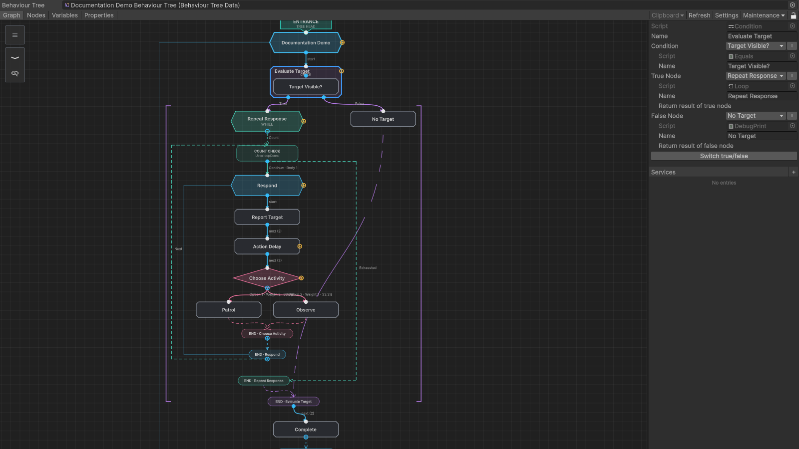
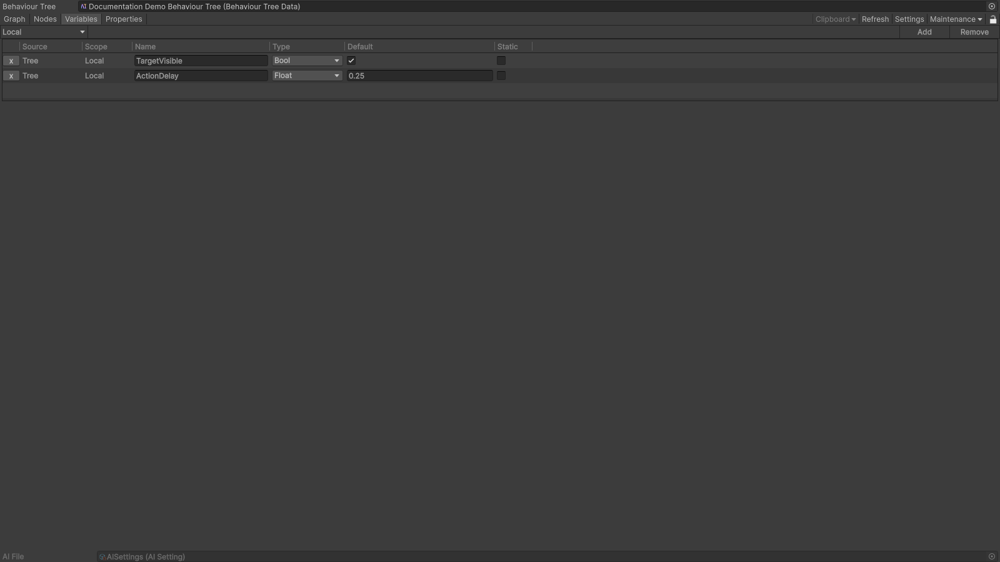
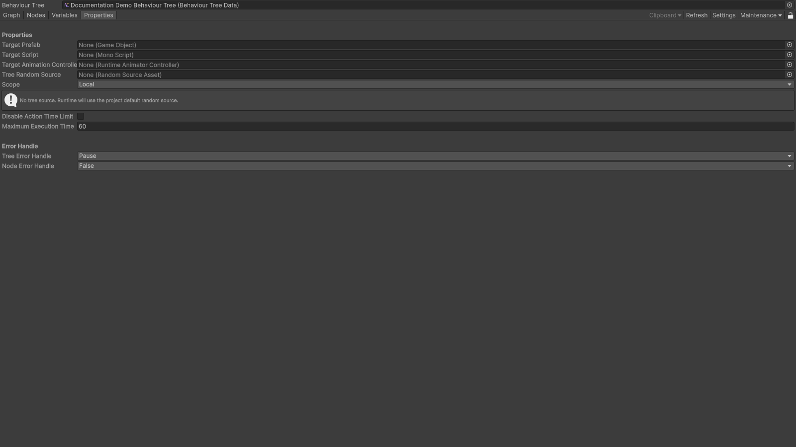

# AI Editor

Open the editor from `Window > Aethiumian AI > AI Editor`, then select a `BehaviourTreeData` asset. The toolbar provides Graph, Nodes, Variables, and Properties pages, plus refresh, settings, and maintenance commands.

## Graph

The Graph page shows the reachable execution flow and the selected node inspector in one workspace. It supports:

- pan with the middle mouse button or Alt + left mouse button, and zoom with the wheel;
- single selection, box selection, grouped dragging, duplication, and deletion;
- node search and creation, compatible-port insertion, and connection;
- context menus, shared clipboard operations between editor windows, and explicit Auto Layout.

Select a node to edit its fields in the right-hand inspector. Control-flow nodes expose ordered outputs, branch nodes expose separate result paths, and services are drawn on a side rail beside their host subtree.

## Variables

The Variables page defines the tree-level values available to nodes. Each row has a name, type, default value, scope, and static option. Variable names must be unique within a tree.

## Properties

The Properties page configures integration and execution settings, including the target script, target prefab, random source, scope, action timeout, and error-handling policies.

Graph positions live in a separate editor-only layout. Opening or refreshing a tree preserves existing coordinates and should not modify the behaviour tree asset.
