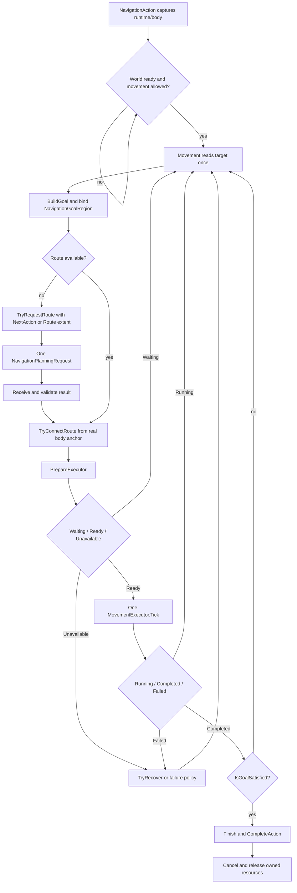

# Navigation action lifecycle

This document describes the current `Movement` contract in the Aethiumian.AI package. The lifecycle is deliberately centered on goal construction, route acquisition, executor progression, recovery, and terminal cleanup.

## Shared fixed-step loop

`Movement` publishes the behaviour-tree result only after terminal cleanup. A `MovementExecutor` result describes one physical action; it does not by itself complete the overall goal.

## Goal construction

Every permitted fixed tick reads the current target once. Trace and Retreat use the current `tracing` object; FixedDestination uses `destination`; Wander lazily selects one nullable point after world readiness and permission, and clears it on restart. The capability then implements `BuildGoal` and binds the resulting request to the action's captured immutable `INavigationWorld`.

`NavigationGoalRegion` is the authoritative goal geometry and identity. It contains the target bounds, metric, tolerance, world snapshot, and request identity used to decide whether a result is still adoptable. Target motion may invalidate a pending result; it cannot make a stale result bypass current-goal validation.

## Action acquisition

Simple and Smart both obtain actions from `NavigationRoute`:

- Simple passes `NavigationPlanningExtent.NextAction` and asks for a local executable step.
- Smart passes `NavigationPlanningExtent.Route` and may adopt an executable prefix.
- `TryConnectRoute` reconnects a candidate to the current body and rejects unsafe or disconnected geometry.
- `PrepareExecutor` returns `Waiting`, `Ready`, or `Unavailable` for one segment.

At most one `NavigationPlanningRequest` is held by one Movement execution. It contains the operation/result receipt, captured start and goal, purpose, committed predecessor, and cancellation resource. The owner detaches it before cancellation and disposal. Background planning never invokes an executor or Unity callback directly; result adoption is performed by the Movement fixed-step loop.

A moving target is coalesced through the single in-flight request. After completion, executable results retain their original goal snapshot; their endpoint need not satisfy the latest target. Position changes beyond geometry epsilon permit another request. A negative result for an old target cannot terminate the current goal.

`PrepareExecutor` receives a segment and body, not a goal. `Waiting` and `Unavailable` leave the previous executor untouched. Same-direction Ground updates and Fly waypoint updates preserve velocity and idle timing. Ground reconnection combines contiguous straight, same-level segments without crossing other action kinds.

## Executor progression

The capability prepares or reuses one executor. `MovementExecutor.IsExecuting` is the action-lifetime predicate.

1. Connect the next segment from the actual physics anchor.
2. Prepare or update the executor; publish the replacement route only after preparation succeeds.
3. Tick once with `Time.fixedDeltaTime`.
4. Keep the executor active for `Running`; release terminal action resources for `Completed` or `Failed`.
5. Evaluate the overall goal and either continue, recover, or finish.

| Capability | Executor | Contract |
| --- | --- | --- |
| `Walk` | `GroundTraversalExecutor` | Ground action, support, local continuation, and at most two unexpected-landing recoveries |
| `Jump` | `BallisticJumpExecutor` / `TimedForceExecutor` | Real contact, launch interval, physical flight, and landing-bound completion |
| `Fly` | `FlyTraversalExecutor` | Waypoint completion, dynamic reconnection, clearance, and height limits |

Jump preparation returns `Waiting` without real contact or before the launch interval. Once flight/descent has ended and non-ascending landing support is established, an endpoint mismatch returns `UnexpectedSupport` instead of waiting for a trajectory that can no longer correct it. Irreversible Jump/Fall/DropThrough actions are allowed to finish before a replacement route is adopted.

## Recovery and terminal states

`Running` includes world readiness, permission pauses, physical prerequisites, active execution, and pending planning. A permission pause resets executor/watchdog/Retreat observations without advancing time or writing movement.

Recovery remains at the Movement owner:

- exact `NoResult`, `SearchExhausted`, and `BudgetReached` planner outcomes retain their distinction;
- stale or cancelled requests are released before fresh planning;
- physical failure is handled before Retreat finalization, so cleanup cannot turn a failure into success;
- reversible updates preserve the executing action when possible; only a Ready preparation publishes replacement route state;
- no-progress route continuation is capped at three attempts.

`IsGoalSatisfied` is the overall completion predicate. `Finish` applies capability-specific final effects, then `CompleteAction` cancels the execution token and releases the action, request, route, lease, and executor resources.

## Ownership map

| Responsibility | Owner |
| --- | --- |
| Runtime/world/body capture and terminal cleanup | `NavigationAction` |
| Per-tick target read and goal construction | `Movement` plus capability `BuildGoal` |
| Route and request coordination | `Movement.Navigation.cs` |
| Request data and cancellation receipt | Private `NavigationPlanningRequest` |
| Route reconnection | Capability `TryConnectRoute` |
| Action preparation | Capability `PrepareExecutor` |
| Physical progression and action-local resources | `MovementExecutor` implementations |
| Overall recovery and completion | `TryRecover`, `IsGoalSatisfied`, `Finish` |

`Movement` exposes its executor only for the existing live inspection/debug contract. Route/request coordinator state is not a public session API and does not become a test façade.

## Planning API boundary

`MapNavigationRuntime.PlanWalkAsync`, `PlanJumpAsync`, and `PlanFlyAsync` take `NavigationPlanningExtent` after their parameter object and before `CancellationToken`. `PlanWalkStepAsync` is removed. `NextAction` uses local planning; `Route` is the Smart horizon.

Local Jump expands one launch-support successor set. Local Fly checks direct flight and adjacent legal flight steps. Neither local mode performs global search followed by truncation, and a local failure is not promoted to a whole-world no-path claim.

## Extension and migration contract

External movement implementations use the protected `BuildGoal`, `TryRequestRoute`, `TryConnectRoute`, `PrepareExecutor`, `IsGoalSatisfied`, `TryRecover`, `Finish`, and required `GetWanderLocation` hooks. They must preserve the one-executor and fixed-step result-adoption boundaries.

The former `MovementGoalProvider`, `RollingNavigationSession`, public `Movement.Navigation`, public session wrappers, and reflection adapters are removed. They are not compatibility surfaces and must not be restored to satisfy old diagnostics or tests.

## Validation boundary

Connected Unity compilation and focused tests provide contract evidence. A queued, running, zero-result, timed-out, or infrastructure-error scheduler response is not a passing test. Scene feel, animation continuity, and representative multi-agent behavior remain separate runtime acceptance gates.
