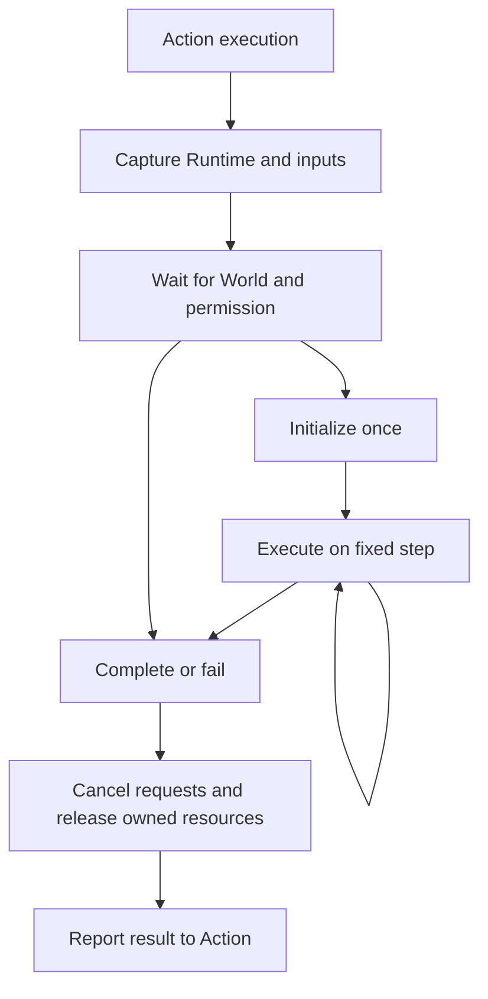

# Navigation action lifecycle

NavigationAction owns captured body dependencies, one borrowed Runtime and World, permission gating, immediate request cancellation and terminal resource release. Runtime absence is an input failure; unpublished geometry is a waiting phase. Current changes never redirect an active run.

Runtime invalidation precedes permission checks. Waiting creates no executor, route request, lease or Wander target. Permission pauses execution and resets progress observations without advancing timers. Forced stop uses the same idempotent release path, but does not apply success position or velocity effects. The node never disposes the borrowed Runtime.

## Responsibilities

- NavigationAction: captures dependencies in Awake; initializes and advances only from the permitted FixedUpdate path; releases partial initialization on faults. Its execution cancellation token is cancelled before tree result consumption.
- Movement: initializes goal providers and optional Retreat state, selects direct versus rolling-route advancement and owns RollingNavigationSession. The session retains route/request/cursor ownership and existing continuation algorithms.
- Walk, Jump and Fly: provide geometry, planning, direct actions, executor integration and capability-specific completion effects. They release only their owned executor and local state.
- FixedJump: captures its target and jump parameters before waiting, then launches or submits its one-step request using the actual current body anchor.
- Sprint: does not require a navigation world. `forceApplication` selects `Timed` (default, existing TimedForceExecutor) or `Legacy` (historical initial force plus repeated force). Selection and timer reset occur once per execution.

## Strategies and compatibility

`PathMode.Simple = 0` and `Smart = 1` remain stable. Naive and Simple currently share implementation semantics; no duplicate policy class or additional serialized mode is introduced. Walk Simple still uses local single-step planning, while Jump/Fly Simple retain direct execution. Smart Walk's existing continuous-ground preference and fast mixed-search behavior are unchanged.

Old Pathfinder infrastructure and non-Movement project consumers remain. Movement nodes do not call it. The process-wide MovementBackend selector is removed; Sprint's legacy capability remains selectable on the node.

The protected startup/tick/cleanup extension contract has changed deliberately. Subclasses use InitializeMovement, BeforeMovementTick, TickDirectMovement and ReleaseMovementResources; they do not override the sealed action lifecycle or dispose Runtime. Tests must wait for actual action initialization rather than assume Awake or one physics yield performed it.

## Acceptance status

Source implementation and static residue/diff review only. A separate acceptance task must compile and validate readiness, re-entry, cancellation, FixedJump target capture, lease restoration, movement goals and both Sprint modes. No runtime pass is implied by this document.
