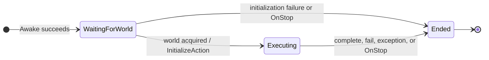
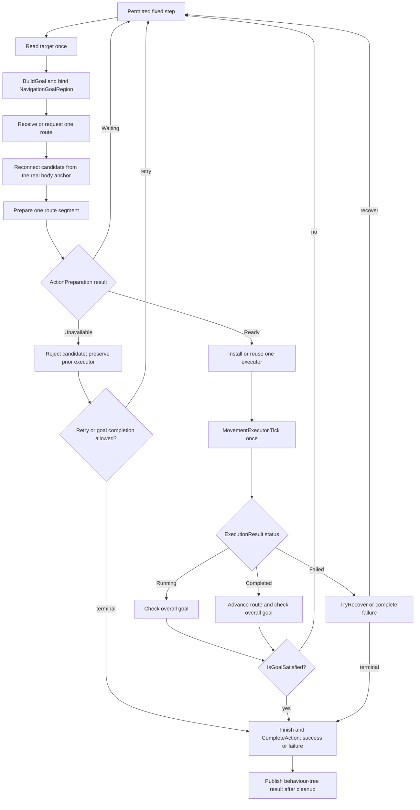

# Navigation action lifecycle

This document describes the current `Movement` contract in the Aethiumian.AI package. It separates three different concerns that must not be drawn as one state machine:

1. `NavigationAction` owns the action lifetime.
2. `Movement` coordinates planning and one fixed-step execution loop.
3. `PrepareExecutor` and `MovementExecutor.Tick` return per-step outcomes; they do not define action states.

## NavigationAction lifecycle

The lifecycle has only the phases owned by `NavigationAction`: waiting for the immutable world binding, executing the action, and ended. Permission pauses, pending planning, and a missing successor do not create additional lifecycle states.

`WaitingForWorld` means that `InitializeAction` and `TickAction` have not started. While in this phase, an unavailable world or `CanMove == false` repeats the same fixed-step wait. Once the world is acquired, the phase remains `Executing` for the rest of the run. In particular, `Executing` includes permission pauses, pending `NavigationPlanningRequest`s, route acquisition, an active executor, and the gap between completed segments. These repeated internal observations are intentionally omitted from the primary state graph so they do not obscure the lifecycle transitions.

`Ended` is the terminal lifecycle phase. `CompleteAction` or `CompleteActionException` releases the cancellation source, request, route, executor, and capability-specific resources before the behaviour-tree result is published. `OnDestroy` uses the same release boundary when the tree stops the action.

## Movement fixed-step coordinator

This is a repeated coordination loop inside the `Executing` phase, not another lifecycle state machine:

The loop has one physical writer: the currently installed `MovementExecutor`. A `MovementExecutor` result describes one physical segment; it does not by itself complete the overall goal. `Movement` publishes the behaviour-tree result only after terminal cleanup.

## Preparation outcomes, not lifecycle states

`PrepareExecutor` returns `ActionPreparation` for the current route segment. These values are consumed during the current fixed step and must not be shown as states of `NavigationAction`:

| Preparation result | Meaning | Coordinator action |
| --- | --- | --- |
| `Waiting` | A temporary prerequisite is not ready yet, such as the Jump launch gate or contact requirement. | Keep the previous executor untouched and retry on a later permitted fixed step. |
| `Ready` | The segment has produced an executing executor. | Install the executor and publish the connected route. Only this result may replace executor/route state. |
| `Unavailable` | This segment cannot be prepared under the current physical or capability constraints. | Leave the previous executor untouched, reject the candidate, and apply the normal retry/recovery or terminal policy. |

`Waiting` and `Unavailable` therefore have different meanings, but neither is a persistent phase. They are decisions made by `Movement` at the `PrepareRoute` boundary. Likewise, `Running`, `Completed`, and `Failed` are `ExecutionResult.Status` values returned by one executor tick, not additional `NavigationAction` states.

## Goal construction

Every permitted fixed tick reads the current target once. Trace and Retreat use the current `tracing` object; FixedDestination uses `destination`; Wander lazily selects one nullable point after world readiness and permission, and clears it on restart. The capability then implements `BuildGoal` and binds the resulting request to the action's captured immutable `INavigationWorld`.

`NavigationGoalRegion` is the authoritative goal geometry and identity. It contains the target bounds, metric, tolerance, world snapshot, and request identity used to decide whether a result is still adoptable. Target motion may invalidate a pending result; it cannot make a stale result bypass current-goal validation.

## Action acquisition

Simple and Smart both obtain actions from `NavigationRoute`:

- Simple passes `NavigationPlanningExtent.NextAction` and asks for a local executable step.
- Smart passes `NavigationPlanningExtent.Route` and may adopt an executable prefix.
- `TryConnectRoute` reconnects a candidate to the current body and rejects unsafe or disconnected geometry.
- `PrepareExecutor` returns `Waiting`, `Ready`, or `Unavailable` for one segment.

At most one `NavigationPlanningRequest` is held by one Movement execution. It contains the operation/result receipt, captured start and goal, purpose, committed predecessor, and cancellation resource. The owner detaches it before cancellation and disposal. Background planning never invokes an executor or Unity callback directly; result adoption is performed by the Movement fixed-step loop.

A moving target is coalesced through the single in-flight request. After completion, executable results retain their original goal snapshot; their endpoint need not satisfy the latest target. Position changes beyond geometry epsilon permit another request. A negative result for an old target cannot terminate the current goal.

`PrepareExecutor` receives a segment and body, not a goal. `Waiting` and `Unavailable` leave the previous executor untouched. Same-direction Ground updates and Fly waypoint updates preserve velocity and idle timing. Ground reconnection combines contiguous straight, same-level segments without crossing other action kinds.

## Executor progression

The capability prepares or reuses one executor. `MovementExecutor.IsExecuting` is the current executor-segment lifetime predicate; it is not the lifetime of the enclosing `NavigationAction`.

1. Connect the next segment from the actual physics anchor.
2. Prepare or update the executor; publish the replacement route only after preparation succeeds.
3. Tick once with `Time.fixedDeltaTime`.
4. Keep the executor active for `Running`; release terminal action resources for `Completed` or `Failed`.
5. Evaluate the overall goal and either continue, recover, or finish.

When an executor reports `Completed`, `Movement` first receives any already available route result and attempts to prepare the next segment. If the node has not completed and no successor is ready, the existing completion path clears the rigidbody velocity once and then continues with the normal `RequestNextRoute` call. This is not repeated from the per-tick `ActiveSegment == null` wait path. For a partial route whose final Ground segment has just completed without an active successor, the next request starts from that segment's logical endpoint. The endpoint is a consumed planning boundary, not a physics teleport: route adoption still reconnects from the real body anchor and validates support and clearance.

For `Walk`, a Jump candidate whose logical start remains within the completed Ground action's horizontal completion range and vertical support tolerance may be accepted as a continuation. This proximity check only admits the candidate to preparation; the Jump is then re-solved from the real grounded anchor through `GroundJumpSolver`, including support, surface, height, clearance, and landing checks. OneWay collision leases are rebuilt from that actual trajectory. Fall and DropThrough retain their existing strict continuation tolerance because they do not use this grounded re-solve path. Waiting for a successor never locks the body velocity across frames.

| Capability | Executor | Contract |
| --- | --- | --- |
| `Walk` | `GroundTraversalExecutor` | Ground action, support, local continuation, and at most two unexpected-landing recoveries |
| `Jump` | `BallisticJumpExecutor` / `TimedForceExecutor` | Real contact, launch interval, physical flight, and landing-bound completion |
| `Fly` | `FlyTraversalExecutor` | Waypoint completion, dynamic reconnection, clearance, and height limits |

Jump preparation returns `Waiting` without real contact or before the launch interval. Once flight/descent has ended and non-ascending landing support is established, an endpoint mismatch returns `UnexpectedSupport` instead of waiting for a trajectory that can no longer correct it. Irreversible Jump/Fall/DropThrough actions are allowed to finish before a replacement route is adopted.

## Recovery and terminal states

`NavigationAction.Executing` includes permission pauses, physical prerequisites, active execution, and pending planning. `ExecutionStatus.Running` is narrower: the current executor tick has not produced a terminal result. A permission pause resets executor/watchdog/Retreat observations without advancing time or writing movement.

Recovery remains at the Movement owner:

- exact `NoResult`, `SearchExhausted`, and `BudgetReached` planner outcomes retain their distinction;
- stale or cancelled requests are released before fresh planning;
- physical failure is handled before Retreat finalization, so cleanup cannot turn a failure into success;
- reversible updates preserve the executing action when possible; only a Ready preparation publishes replacement route state;
- no-progress route continuation is capped at three attempts.

`IsGoalSatisfied` is the overall completion predicate. `Finish` applies capability-specific final effects, then `CompleteAction` cancels the execution token and releases the action, request, route, lease, and executor resources.

## Ownership map

| Responsibility | Owner |
| --- | --- |
| Runtime/world/body capture and terminal cleanup | `NavigationAction` |
| Per-tick target read and goal construction | `Movement` plus capability `BuildGoal` |
| Route and request coordination | `Movement.Navigation.cs` |
| Request data and cancellation receipt | Private `NavigationPlanningRequest` |
| Route reconnection | Capability `TryConnectRoute` |
| Action preparation | Capability `PrepareExecutor` |
| Physical progression and action-local resources | `MovementExecutor` implementations |
| Overall recovery and completion | `TryRecover`, `IsGoalSatisfied`, `Finish` |

`Movement` exposes its executor only for the existing live inspection/debug contract. Route/request coordinator state is not a public session API and does not become a test façade.

## Planning API boundary

`MapNavigationRuntime.PlanWalkAsync`, `PlanJumpAsync`, and `PlanFlyAsync` take `NavigationPlanningExtent` after their parameter object and before `CancellationToken`. `PlanWalkStepAsync` is removed. `NextAction` uses local planning; `Route` is the Smart horizon.

Local Jump expands one launch-support successor set. Local Fly checks direct flight and adjacent legal flight steps. Neither local mode performs global search followed by truncation, and a local failure is not promoted to a whole-world no-path claim.

## Extension and migration contract

External movement implementations use the protected `BuildGoal`, `TryRequestRoute`, `TryConnectRoute`, `PrepareExecutor`, `IsGoalSatisfied`, `TryRecover`, `Finish`, and required `GetWanderLocation` hooks. Implementations must preserve the one-executor and fixed-step result-adoption boundaries. The partial Ground continuation rule is owned by `Movement`; it does not require a new derived-class interface.

The former `MovementGoalProvider`, `RollingNavigationSession`, public `Movement.Navigation`, public session wrappers, and reflection adapters are removed. They are not compatibility surfaces and must not be restored to satisfy old diagnostics or tests.

## Validation boundary

Connected Unity compilation and focused tests provide contract evidence. A queued, running, zero-result, timed-out, or infrastructure-error scheduler response is not a passing test. Scene feel, animation continuity, and representative multi-agent behavior remain separate runtime acceptance gates.
