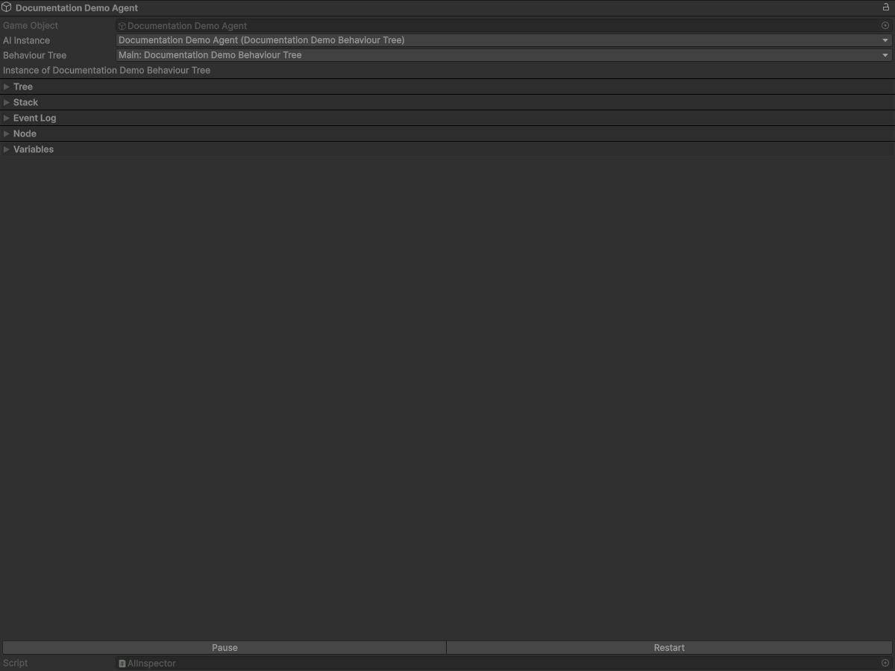

# 排障指南

以下按源码行为给出排障路径。语义以当前 `AI`、`BehaviourTree` 与 `AI Editor` 实现为准。

## 快速检查清单

1. `AI.Data` 是否为空。
   - `AI.Awake()` 中 `Data` 为空时直接 `enabled = false`，行为树不会创建也不会运行。
2. 是否处于 Play Mode。
   - `Update / LateUpdate / FixedUpdate` 都由 `AI` 在运行时更新。
3. 行为树是否有有效入口。
   - `headNodeUUID` 不存在会触发 `Invalid behaviour tree, no head was found`。
4. 是否存在空节点引用。
   - `Runtime/Tree/BehaviourTree.cs` 在构建引用链时若读到空引用会抛异常，通常是资产序列化异常或手工编辑异常。
5. `targetScript` 是否可解析。
   - `AI.OnValidate()` 在对象同层查找 `targetScript`，未找到会记录错误日志。

## AI Inspector 与运行时控制

组件与 Inspector 暴露的控制项包括：`Start Behaviour Tree`、`Reload Behaviour Tree`、`Pause`、`Continue`、`End`。

### 组件菜单语义

- `Start Behaviour Tree`：等价于 `StartBehaviourTree()`。
- `Reload Behaviour Tree`：等价于 `Reload()`。若正在运行，会先 `End()` 后重建树。
- `Pause`：等价于 `Pause()`，仅将主栈标记为暂停。
- `Continue`：等价于 `Continue()`，清除暂停标志并恢复 Tick。
- `End`：等价于 `End()`，结束主栈与全部子栈。

### Inspector 按钮语义

- 未运行且处于 Play Mode：显示 `Start`，可手动启动。
- 运行中：显示两态 `Pause / Continue` 与 `Restart`。
  - `Pause/Continue` 切换的是运行时暂停状态。
  - `Restart` 在 Inspector 上会调用 `selected.Reload()`。

## Reload / Pause / Continue 的实际差异

- `Reload`：销毁当前运行时树实例并从序列化资产重建树。仅当 `autoRestart = true` 时，重载后会自动重启；`autoRestart = false` 时不会重启。
- `Pause`：保留当前运行时状态与栈，只停止继续 Tick。
- `Continue`：恢复 `Pause` 后的 Tick，不重建树，不重置变量。
- `Restart`：本质上是 `Reload` 的 Inspector 调用入口。

`BehaviourTree.Update`、`BehaviourTree.LateUpdate`、`BehaviourTree.FixedUpdate` 在 `mainStack.IsPaused` 时都会直接返回，所以 Pause 会阻断执行。

## DebugPrint / DebugPrintf

- `DebugPrint`：`Debug.Log(message.Value, sender.GameObjectValue)`，并返回 `returnValue` 映射状态。
- `DebugPrintf`：`Debug.Log(string.Format(message.StringValue, value.Value), sender.GameObjectValue)`，并返回 `returnValue` 映射状态。
- `sender.GameObjectValue` 不一定非空，日志仍按 `Debug.Log` 语义输出。
- 格式字符串与参数类型不匹配会触发异常，命中错误处理策略（如 `Pause / Restart / Throw`）时按策略处理。

## 常见症状与排查表

| 现象 | 可能原因 | 核对点 |
| :--- | :--- | :--- |
| Play Mode 中无行为执行 | `Data` 为空、未手动 Start，或 `awakeStart` 未开启 | 检查 `AI.Data`、`awakeStart` 与 Play Mode 下 Start 按钮状态 |
| 编辑器中出现空引用节点错误 | 引用链中有空 `NodeReference` | 检查 `head` 与 `Reference` UUID 是否一致 |
| 没有日志输出 | 节点未被命中，或 `DebugPrintf` 格式参数异常 | 用断点确认 `Execute()` 命中，先看 Console |
| 修改后行为反复异常 | 运行时实例未重建 | 先执行 `Reload Behaviour Tree` 后复测 |

## Console 与断点排查

先按关键字过滤 Console：

- `Invalid behaviour tree, no head was found`
- `Encounter null node in behaviour tree`
- `Cannot found target script`
- `string.Format`

复现稳定后，优先在 `Runtime/AI.cs`、`Runtime/Tree/BehaviourTree.cs` 与相关 `Calls/*` 节点的 `Execute()` 上加断点。异常栈顶部通常是最先中断点。  
若问题在编辑器侧发生，先确认是否在 `Window/Aethiumian AI/AI Editor` 复现，再按调用栈区分是编辑器脚本还是运行时脚本抛出。
