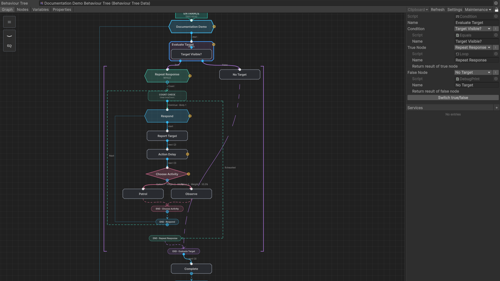
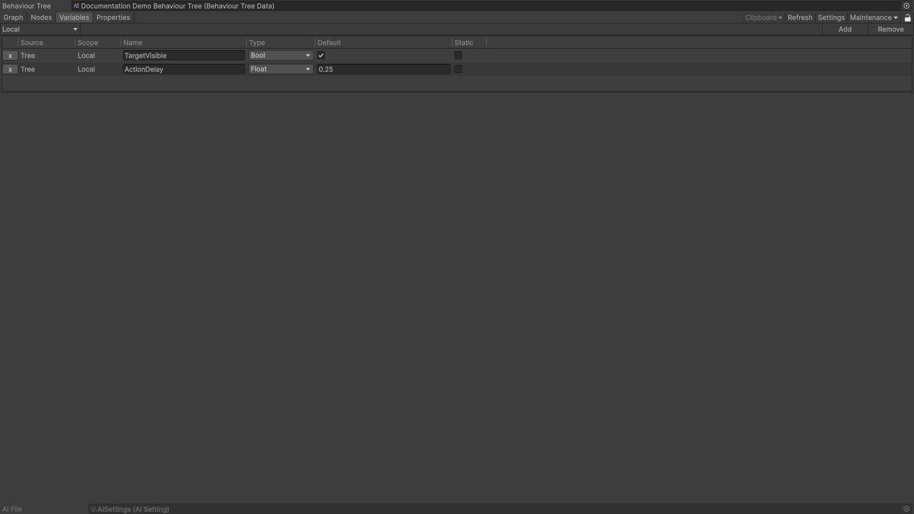
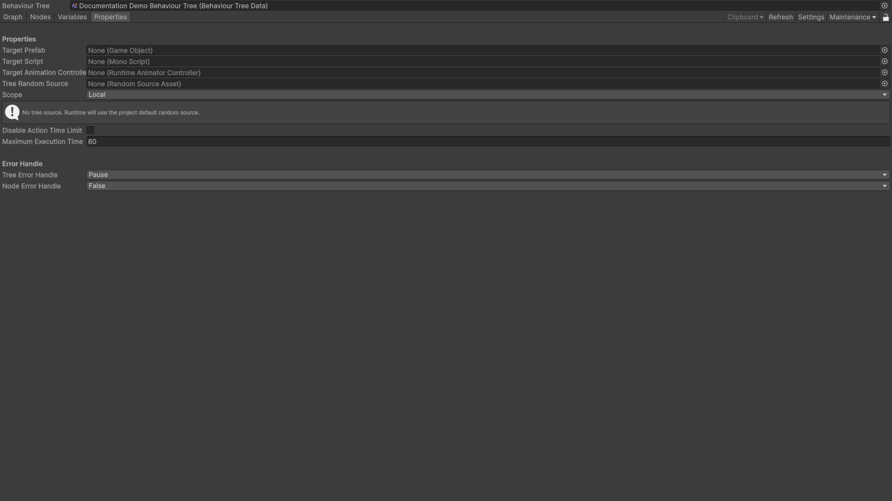

---
hide:
  - navigation
  - toc
---

  <section class="aeth-home__hero">
    <h1 class="sr-only">Aethiumian.AI</h1>
    
    
    
面向 Unity 的行为树运行时与编辑器：可视化搭建行为树、绑定变量，并用自己的玩法节点扩展。

    

      <a class="md-button md-button--primary" href="installation/">安装</a>
      <a class="md-button" href="getting-started/">快速上手</a>
    

  </section>

  <section class="aeth-home__section">
    <h2>快速上手</h2>
    <ol class="aeth-home__steps">
      <li>
        <a href="installation/">
          <h3>安装包</h3>
          
导入包并完成基础工程配置。

        </a>
      </li>
      <li>
        <a href="getting-started/">
          <h3>创建第一棵树</h3>
          
新建行为树并绑定到 AI 组件。

        </a>
      </li>
      <li>
        <a href="runtime-integration/">
          <h3>接入运行时</h3>
          
将执行流程接入 Unity 生命周期并了解运行时控制。

        </a>
      </li>
      <li>
        <a href="debugging/">
          <h3>排障</h3>
          
按常见症状核对日志、控制台和断点。

        </a>
      </li>
    </ol>
  </section>

  <section class="aeth-home__section">
    <h2>常用入口</h2>
    

      <a class="aeth-card" href="editor/">
        <h3 class="aeth-card__title">AI 编辑器</h3>
        
在图编辑器里搭建节点结构、变量与属性。

      </a>
      <a class="aeth-card" href="variables/">
        <h3 class="aeth-card__title">变量系统</h3>
        
变量声明、作用域与数据流。

      </a>
      <a class="aeth-card" href="runtime-integration/">
        <h3 class="aeth-card__title">运行时集成</h3>
        
树与运行时状态的绑定与更新。

      </a>
      <a class="aeth-card" href="custom-nodes/">
        <h3 class="aeth-card__title">自定义节点</h3>
        
实现你自己的玩法相关节点。

      </a>
      <a class="aeth-card" href="reference/">
        <h3 class="aeth-card__title">节点参考</h3>
        
查节点的公开输入、输出与行为约束。

      </a>
    

  </section>

  <section class="aeth-home__section">
    <h2>编辑器一览</h2>
    <figure class="aeth-home__screenshot">
      
      <figcaption>图：树结构、连线与执行路由。</figcaption>
    </figure>
    

      <figure class="aeth-home__screenshot">
        
        <figcaption>变量：查看和配置变量状态。</figcaption>
      </figure>
      <figure class="aeth-home__screenshot">
        
        <figcaption>属性：树级设置与元数据。</figcaption>
      </figure>
    

  </section>

  <section class="aeth-home__section aeth-home__about">
    

      <h2>环境要求</h2>
      <ul>
        <li>推荐 Unity 6（<code>6000.x</code>）。<code>2021.3</code> 及以上版本可以安装，但未经测试，不做兼容保证。</li>
        <li>Aethiumian.AI 本身未声明额外的包依赖。</li>
      </ul>
    

    

      <h2>名称来源</h2>
      
Aethiumian 源自《米埃里亚图书馆》中的“魔法生物”，中文中称作“辉石生物”。

    

  </section>

